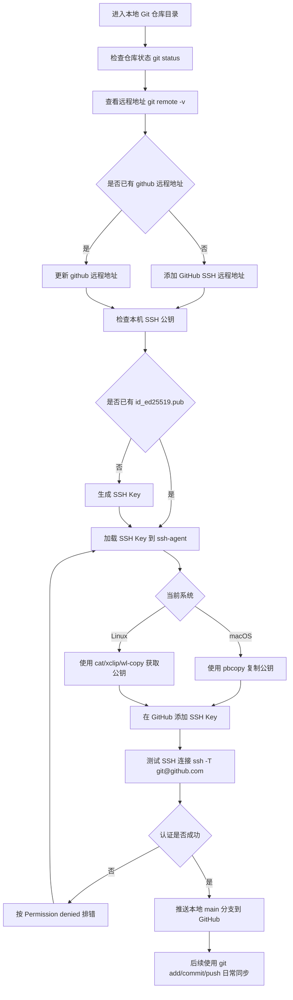

# GitHub SSH 同步作业指导书

## 目的

将本地 Git 仓库同步到 GitHub 远程仓库，并使用 SSH 方式进行后续推送。

适用场景：

- 本地已经有一个 Git 仓库。
- 需要把本地仓库推送到 GitHub。
- 需要同时保留 Gitee 和 GitHub 两个远程地址。

## 前置条件

1. 本机已安装 Git。
2. 已有 GitHub 账号。
3. GitHub 上已经创建目标仓库，例如：

```bash
git@github.com:goldf2/gitlearn.git
```

4. 终端能进入本地仓库目录。

macOS 示例：

```bash
cd "/Volumes/资料/git test"
```

Linux 示例：

```bash
cd ~/git-test
```

## 操作流程



说明：支持 Mermaid 交互链接的平台可以点击流程图节点跳转到对应章节；如果当前平台禁用了 Mermaid 点击事件，仍可按下方章节顺序阅读。

<a id="check-repo"></a>

### 1. 检查本地仓库状态

进入仓库目录后执行：

```bash
git status
```

如果能看到当前分支和文件状态，说明当前目录是 Git 仓库。

查看当前远程地址：

```bash
git remote -v
```

<a id="config-remote"></a>

### 2. 配置 GitHub 远程地址

如果还没有名为 `github` 的远程地址，执行：

```bash
git remote add github git@github.com:goldf2/gitlearn.git
```

如果已经存在 `github`，执行：

```bash
git remote set-url github git@github.com:goldf2/gitlearn.git
```

再次确认：

```bash
git remote -v
```

应该能看到类似结果：

```bash
github  git@github.com:goldf2/gitlearn.git (fetch)
github  git@github.com:goldf2/gitlearn.git (push)
```

<a id="check-ssh-key"></a>

### 3. 检查本机 SSH Key

检查是否已有 SSH 公钥：

```bash
ls ~/.ssh/id_ed25519.pub
```

如果文件存在，继续下一步。

如果提示文件不存在，生成新的 SSH Key：

```bash
ssh-keygen -t ed25519 -C "你的邮箱"
```

按提示一路回车即可。

<a id="ssh-agent"></a>

### 4. 将 SSH Key 加入 ssh-agent

macOS 执行：

```bash
ssh-add --apple-use-keychain ~/.ssh/id_ed25519
```

Linux 执行：

```bash
eval "$(ssh-agent -s)"
ssh-add ~/.ssh/id_ed25519
```

查看是否加载成功：

```bash
ssh-add -l -E sha256
```

如果能看到一条 `ED25519` 记录，说明加载成功。

<a id="add-key-to-github"></a>

### 5. 添加 SSH Key 到 GitHub

macOS 复制公钥到剪贴板：

```bash
pbcopy < ~/.ssh/id_ed25519.pub
```

Linux 可以先直接打印公钥内容，再手动复制整行：

```bash
cat ~/.ssh/id_ed25519.pub
```

如果 Linux 已安装剪贴板工具，也可以使用：

```bash
xclip -selection clipboard < ~/.ssh/id_ed25519.pub
```

Wayland 桌面环境可使用：

```bash
wl-copy < ~/.ssh/id_ed25519.pub
```

打开 GitHub 网页，按以下路径操作：

```text
右上角头像 -> Settings -> SSH and GPG keys -> New SSH key
```

填写：

- Title：例如 `MacBook Pro` 或 `Linux PC`
- Key：粘贴刚才复制的公钥内容

然后点击保存。

注意：SSH Key 必须添加到拥有目标仓库权限的 GitHub 账号里。

<a id="test-ssh"></a>

### 6. 测试 SSH 连接

执行：

```bash
ssh -T git@github.com
```

如果看到类似结果：

```bash
Hi goldf2! You've successfully authenticated, but GitHub does not provide shell access.
```

说明 SSH 配置成功。

<a id="push-to-github"></a>

### 7. 推送本地仓库到 GitHub

推送当前 `main` 分支：

```bash
git push -u github main
```

参数说明：

- `github`：远程仓库名称。
- `main`：本地分支名称。
- `-u`：设置默认上游分支，后续可以直接使用 `git push`。

成功后，本地仓库就同步到了 GitHub。

<a id="daily-sync"></a>

## 后续日常同步

修改文件后，按以下流程提交并推送：

```bash
git status
git add .
git commit -m "更新"
git push
```

如果同时需要推送到 Gitee 和 GitHub，可以分别执行：

```bash
git push origin main
git push github main
```

## 常见问题处理

### 问题 1：remote github already exists

原因：已经存在名为 `github` 的远程地址。

处理：

```bash
git remote set-url github git@github.com:goldf2/gitlearn.git
```

### 问题 2：Permission denied (publickey)

原因：GitHub 没有接受当前电脑的 SSH Key。

<a id="permission-denied"></a>

处理步骤：

macOS：

```bash
ssh-add --apple-use-keychain ~/.ssh/id_ed25519
pbcopy < ~/.ssh/id_ed25519.pub
```

Linux：

```bash
eval "$(ssh-agent -s)"
ssh-add ~/.ssh/id_ed25519
cat ~/.ssh/id_ed25519.pub
```

Linux 如果安装了剪贴板工具，也可以用下面命令复制公钥：

```bash
xclip -selection clipboard < ~/.ssh/id_ed25519.pub
```

Wayland 桌面环境可使用：

```bash
wl-copy < ~/.ssh/id_ed25519.pub
```

然后到 GitHub：

```text
Settings -> SSH and GPG keys -> New SSH key
```

添加后再测试：

```bash
ssh -T git@github.com
```

### 问题 3：Repository not found

可能原因：

- GitHub 仓库地址写错。
- 当前 GitHub 账号没有仓库权限。
- 仓库还没有创建。

检查远程地址：

```bash
git remote -v
```

检查 GitHub 仓库是否存在：

```text
https://github.com/goldf2/gitlearn
```

### 问题 4：Could not resolve host: github.com

原因：本机 DNS 或网络无法解析 GitHub 域名。

处理建议：

1. 检查网络是否可访问 GitHub。
2. 检查代理或 DNS 设置。
3. 换一个网络后重试。

测试命令：

```bash
nslookup github.com
curl -I https://github.com
```

### 问题 5：GH013 Repository rule violations / Push cannot contain secrets

原因：GitHub Push Protection 检测到提交历史中包含密钥、令牌或云厂商 AccessKey。

处理原则：

1. 不要点击 GitHub 提供的 allow/unblock 链接放行。
2. 先到对应平台禁用或删除已经泄露的密钥。
3. 从文件内容和 Git 历史中彻底移除密钥。
4. 重新推送清理后的历史。

如果是最近几个提交中误提交了密钥，可以先定位：

```bash
git grep -n -I -E 'AccessKey|Secret|LTAI' HEAD -- .
```

删除文件中的密钥内容后提交：

```bash
git add .
git commit -m "移除敏感信息"
```

如果 GitHub 仍然拦截，说明历史提交里仍有密钥，需要重写历史。清理前建议先备份仓库目录，或者确认当前工作区改动已经保存。

常用处理方式：

```bash
git filter-branch --force --tree-filter 'find . -type f -name "*.txt" -exec perl -0pi -e "s/\\AAccessKey ID\\R[^\\r\\n]*\\R\\R?AccessKey Secret\\R[^\\r\\n]*(?:\\R)+//" {} +' -- --all
git push --force-with-lease github main
```

注意：重写历史会改变提交 ID。如果这个仓库已经有其他人协作，需要先通知协作者。

## 推荐远程仓库结构

如果需要同时保留 Gitee 和 GitHub，可以使用：

```bash
origin  git@gitee.com:goldf2/gitlearn.git
github  git@github.com:goldf2/gitlearn.git
```

查看命令：

```bash
git remote -v
```

推送到 Gitee：

```bash
git push origin main
```

推送到 GitHub：

```bash
git push github main
```

## 验收标准

完成后应满足：

1. `git remote -v` 中存在 GitHub SSH 地址。
2. `ssh -T git@github.com` 认证成功。
3. `git push -u github main` 执行成功。
4. GitHub 仓库页面能看到本地仓库文件和提交记录。
