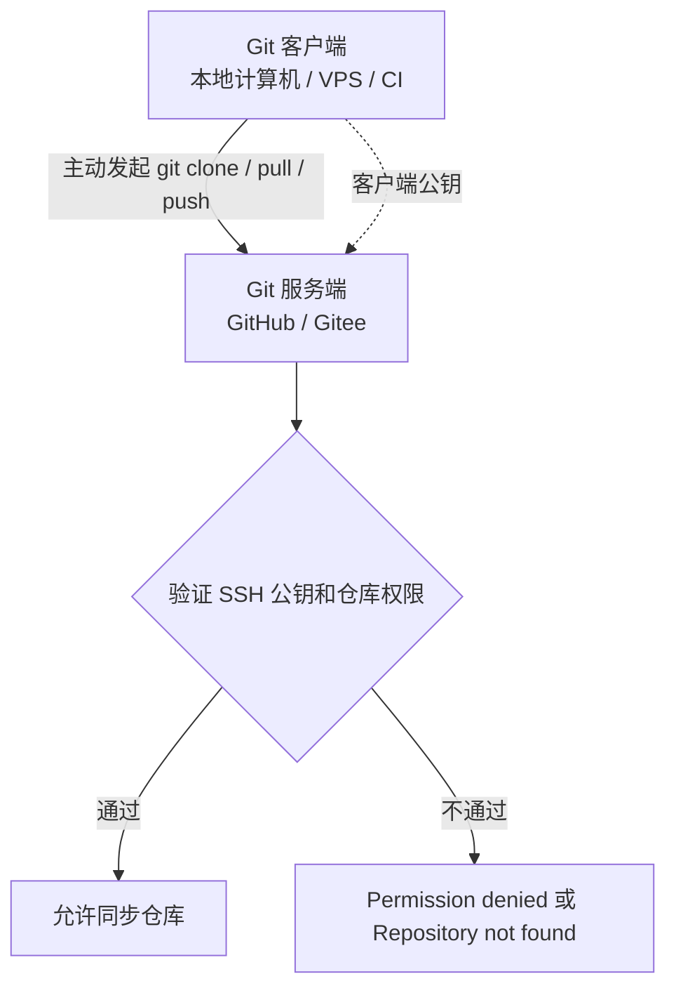

# Git 仓库 SSH 同步认证作业指导书

| 文档信息 | 内容 |
|---------|------|
| 文档编号 | SOP-GIT-SSH-001 |
| 版本 | V1.0 |
| 适用系统 | macOS / Linux / Windows Git Bash / Windows WSL |
| 适用对象 | 本地计算机、VPS、CI 机器、GitHub、Gitee |
| 目标读者 | 需要通过 SSH 同步 Git 仓库的使用者 |
| 编写日期 | 2026-06-24 |

## 引言

SSH 密钥有两种常见用途：一种是 SSH 快捷登录 VPS，另一种是 Git 仓库同步认证。本文件只说明第二种用途：**通过 SSH 认证 GitHub/Gitee，并执行 `git clone`、`git pull`、`git push`**。

在 Git 仓库同步中，客户端是主动发起连接的一端，可以是本地计算机、VPS 或 CI 机器。服务端是 GitHub/Gitee 这类 Git 服务商。Git 服务端不会主动向客户端推流，所有同步动作都由客户端主动发起。

客户端保存自己的私钥，GitHub/Gitee 保存客户端公钥或 Deploy Key。连接时，客户端用私钥证明身份，Git 服务端用已保存的公钥验证身份，并结合仓库权限决定是否允许读取或推送。

## 1. 客户端和服务端关系

| 角色 | 保存内容 | 作用 | 常见位置 |
|------|----------|------|----------|
| Git 客户端：本地计算机、VPS、CI 机器 | 私钥 `id_ed25519`、公钥 `id_ed25519.pub` | 主动发起 `git clone`、`git pull`、`git push` | `~/.ssh/` |
| Git 服务端：GitHub/Gitee | 客户端公钥或 Deploy Key | 验证客户端身份和仓库权限 | SSH Key / Deploy Key 设置页面 |
| ssh-agent | 已加载的客户端私钥 | 让当前会话自动使用私钥 | `ssh-add` |
| known_hosts | Git 服务端主机密钥指纹 | 确认连接到的 Git 服务端没有被替换 | `~/.ssh/known_hosts` |

注意：

- 本地计算机和 VPS 都可以是 Git 客户端。
- GitHub/Gitee 是 Git 服务端。
- 如果 VPS 需要执行 `git pull`，应在 VPS 上生成密钥，并把 VPS 公钥添加到 GitHub/Gitee。
- 不要把本地私钥复制到 VPS 作为部署凭证。

## 2. Git SSH 认证流程



## 3. 前置条件

| 检查项 | 要求 |
|--------|------|
| 本地系统 | 已安装 Git 和 OpenSSH |
| Git 服务端 | 已有 GitHub 或 Gitee 账号 |
| 目标仓库 | GitHub/Gitee 上已创建仓库，或已有访问权限 |
| 网络 | 客户端可访问 GitHub/Gitee |

## 4. 准备客户端 SSH 密钥

客户端可以是本地计算机，也可以是 VPS 或 CI 机器。在哪台机器上执行 Git 同步，就在哪台机器上准备 SSH 密钥。

### 4.1 检查是否已有密钥

```bash
ls -la ~/.ssh/
```

重点查看：

- `id_ed25519`：私钥。
- `id_ed25519.pub`：公钥。

### 4.2 生成新的密钥对

```bash
ssh-keygen -t ed25519 -C "your-email-or-device-name"
```

建议使用默认路径：

```text
~/.ssh/id_ed25519
```

### 4.3 设置权限并加载密钥

```bash
chmod 700 ~/.ssh
chmod 600 ~/.ssh/id_ed25519
chmod 644 ~/.ssh/id_ed25519.pub
```

macOS：

```bash
ssh-add --apple-use-keychain ~/.ssh/id_ed25519
```

Linux / Windows Git Bash：

```bash
eval "$(ssh-agent -s)"
ssh-add ~/.ssh/id_ed25519
```

查看加载结果：

```bash
ssh-add -l -E sha256
```

## 5. 添加公钥到 GitHub/Gitee

### 5.1 复制客户端公钥

macOS：

```bash
pbcopy < ~/.ssh/id_ed25519.pub
```

Linux：

```bash
cat ~/.ssh/id_ed25519.pub
```

Linux 如安装剪贴板工具：

```bash
xclip -selection clipboard < ~/.ssh/id_ed25519.pub
```

Wayland：

```bash
wl-copy < ~/.ssh/id_ed25519.pub
```

Windows Git Bash：

```bash
cat ~/.ssh/id_ed25519.pub
```

复制时必须复制完整一行，从 `ssh-ed25519` 开始，到最后的注释结束。

### 5.2 添加到 GitHub

GitHub 页面路径：

```text
右上角头像 -> Settings -> SSH and GPG keys -> New SSH key
```

填写：

- Title：例如 `MacBook Pro`、`VPS Deploy`。
- Key：粘贴客户端公钥完整内容。

测试：

```bash
ssh -T git@github.com
```

成功结果类似：

```text
Hi username! You've successfully authenticated, but GitHub does not provide shell access.
```

### 5.3 添加到 Gitee

Gitee 页面路径：

```text
右上角头像 -> 设置 -> SSH 公钥 -> 添加公钥
```

填写：

- 标题：例如 `MacBook Pro`、`VPS Deploy`。
- 公钥：粘贴客户端公钥完整内容。

测试：

```bash
ssh -T git@gitee.com
```

## 6. 第一次连接 Git 服务端的 known_hosts

第一次执行下面命令时：

```bash
ssh -T git@gitee.com
```

或：

```bash
ssh -T git@github.com
```

客户端可能会提示是否信任该主机指纹。确认域名无误后输入：

```bash
yes
```

客户端会把 Git 服务端的主机密钥指纹保存到：

```bash
~/.ssh/known_hosts
```

这一步用于确认以后连接的仍然是同一个 Git 服务端主机，不是你的账号授权。账号授权仍然取决于 GitHub/Gitee 上是否保存了你的客户端公钥。

## 7. 配置 Git 远程地址

进入本地仓库目录：

```bash
cd "/path/to/your/repo"
```

检查仓库状态：

```bash
git status
```

查看远程地址：

```bash
git remote -v
```

SSH 地址格式：

```bash
git@github.com:owner/repo.git
git@gitee.com:owner/repo.git
```

设置 Gitee 为 `origin`：

```bash
git remote add origin git@gitee.com:owner/repo.git
```

如果 `origin` 已存在：

```bash
git remote set-url origin git@gitee.com:owner/repo.git
```

同时添加 GitHub：

```bash
git remote add github git@github.com:owner/repo.git
```

如果 `github` 已存在：

```bash
git remote set-url github git@github.com:owner/repo.git
```

确认：

```bash
git remote -v
```

推荐结构：

```text
origin  git@gitee.com:owner/repo.git (fetch)
origin  git@gitee.com:owner/repo.git (push)
github  git@github.com:owner/repo.git (fetch)
github  git@github.com:owner/repo.git (push)
```

## 8. 推送和拉取

确认当前分支：

```bash
git branch --show-current
```

推送到 Gitee：

```bash
git push -u origin main
```

推送到 GitHub：

```bash
git push -u github main
```

如果当前分支不是 `main`，替换为实际分支名。

日常同步：

```bash
git status
git add .
git commit -m "更新说明"
git pull --rebase
git push
```

分别推送到 Gitee 和 GitHub：

```bash
git push origin main
git push github main
```

## 9. VPS 作为 Git 客户端同步仓库

如果部署流程是在 VPS 上执行：

```bash
git clone git@gitee.com:owner/repo.git
git pull
```

那么 VPS 就是 Git 客户端。应在 VPS 上生成 SSH 密钥：

```bash
ssh-keygen -t ed25519 -C "deploy@vps"
```

查看 VPS 公钥：

```bash
cat ~/.ssh/id_ed25519.pub
```

然后把 VPS 公钥添加到 GitHub/Gitee。推荐添加为仓库 Deploy Key，权限范围更小。

| 方式 | 适用场景 | 权限特点 |
|------|----------|----------|
| 账号 SSH Key | VPS 需要访问多个仓库 | 权限较大 |
| Deploy Key 只读 | VPS 只需要拉代码 | 推荐 |
| Deploy Key 可写 | VPS 需要推送代码 | 仅确有需要时使用 |

## 10. 常见问题处理

| 现象 | 常见原因 | 处理 |
|------|----------|------|
| `Permission denied (publickey)` | 公钥未添加到正确账号、ssh-agent 未加载密钥、密钥冲突 | 检查 `ssh-add -l`，重新添加公钥 |
| `Repository not found` | 仓库地址错误、仓库不存在、账号无权限 | 检查 `git remote -v` 和仓库权限 |
| `Could not resolve host` | DNS 或网络问题 | 检查网络、代理、DNS |
| `remote github already exists` | 已存在名为 `github` 的远程 | 使用 `git remote set-url github ...` |
| `Host key verification failed` | known_hosts 中主机指纹不匹配 | 确认安全后清理旧记录 |
| GitHub `GH013` | 提交中包含密钥或令牌 | 删除泄露密钥，清理文件和 Git 历史 |

调试命令：

```bash
ssh -vT git@gitee.com
ssh -vT git@github.com
```

检查敏感信息：

```bash
git grep -n -I -E 'AccessKey|Secret|Token|LTAI' HEAD -- .
```

## 11. 验收标准

1. 执行 Git 同步的客户端存在可用 SSH 密钥。
2. GitHub/Gitee 已添加该客户端的公钥或 Deploy Key。
3. 第一次连接后，`~/.ssh/known_hosts` 中存在 Git 服务端主机记录。
4. `ssh -T git@gitee.com` 或 `ssh -T git@github.com` 认证成功。
5. `git remote -v` 使用 SSH 地址，而不是 HTTPS 地址。
6. `git push`、`git pull` 或 `git clone` 能正常完成。
7. 如 VPS 需要拉代码，VPS 自己的公钥已添加到 GitHub/Gitee。

> 文档结束。Git SSH 同步的关键是：执行 Git 命令的机器是客户端，GitHub/Gitee 是服务端，客户端保存私钥，服务端保存客户端公钥。
