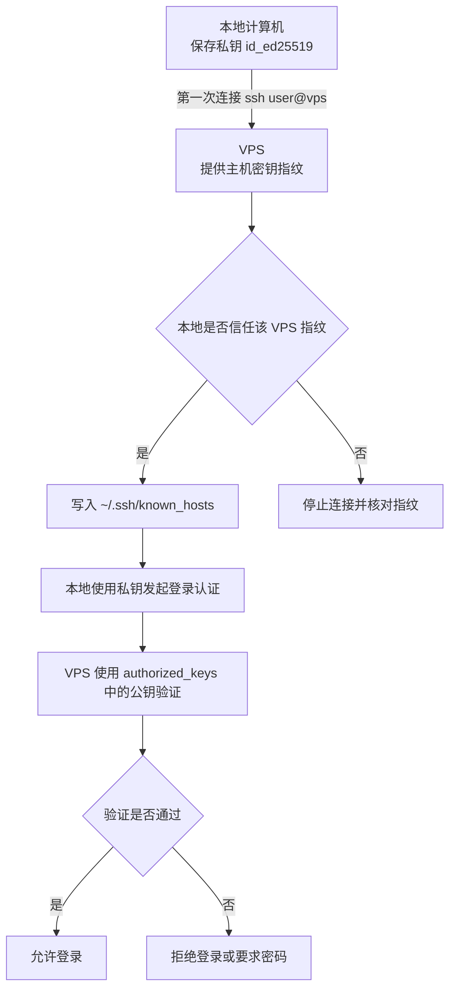

# SSH 密钥与快捷登录 VPS 作业指导书

| 文档信息 | 内容 |
|---------|------|
| 文档编号 | SOP-SSH-LOGIN-001 |
| 版本 | V1.0 |
| 适用系统 | macOS / Linux / Windows Git Bash / Windows WSL |
| 适用对象 | 本地计算机、VPS、远程主机 |
| 目标读者 | 需要配置 SSH 快捷登录、SCP、rsync 的使用者 |
| 编写日期 | 2026-06-24 |

## 引言

SSH 密钥有两种常见用途：一种是登录 VPS 或远程主机，另一种是用于 GitHub/Gitee 等 Git 服务端的仓库同步认证。本文件只说明第一种用途：**SSH 快捷登录 VPS**。

在 SSH 快捷登录场景中，本地计算机是发起连接的客户端，VPS 是接收连接的 SSH 服务端。本地计算机保存自己的私钥，VPS 保存本地计算机的公钥。连接时，本地计算机使用私钥证明身份，VPS 使用 `~/.ssh/authorized_keys` 中的公钥验证身份。

第一次 SSH 连接 VPS 时，本地还会保存 VPS 的主机密钥指纹到 `~/.ssh/known_hosts`。这是为了让本地计算机以后能确认“这台 VPS 还是不是原来的那台”，防止连接到伪造主机。这个主机密钥和你的登录密钥不是同一个东西。

## 1. 角色和密钥关系

| 对象 | 保存内容 | 作用 | 常见位置 |
|------|----------|------|----------|
| 本地计算机 | 本地私钥 `id_ed25519` | 证明“我是谁” | `~/.ssh/id_ed25519` |
| 本地计算机 | VPS 主机密钥指纹 | 记住“这台 VPS 是谁” | `~/.ssh/known_hosts` |
| VPS | 本地公钥 `id_ed25519.pub` | 判断本地计算机是否允许登录 | `~/.ssh/authorized_keys` |
| ssh-agent | 已加载的本地私钥 | 让当前会话自动使用私钥 | `ssh-add` |

注意：

- 私钥只保存在本地计算机，不要上传到 VPS。
- 公钥可以放到 VPS 的 `authorized_keys`。
- `known_hosts` 保存的是 VPS 主机身份，不是你的登录授权。

## 2. SSH 登录认证流程



## 3. 前置条件

| 检查项 | 要求 |
|--------|------|
| 本地系统 | 已安装 OpenSSH |
| VPS | 已开启 SSH 服务 |
| 网络 | 本地能访问 VPS 的 SSH 端口，通常是 22 |
| 首次部署公钥 | 需要 VPS 用户名和密码，或已有其他登录方式 |

## 4. 准备本地 SSH 密钥

### 4.1 检查是否已有密钥

```bash
ls -la ~/.ssh/
```

重点查看：

- `id_ed25519`：私钥。
- `id_ed25519.pub`：公钥。

也可以直接检查：

```bash
ls ~/.ssh/id_ed25519.pub
```

### 4.2 生成新的密钥对

如果没有密钥，执行：

```bash
ssh-keygen -t ed25519 -C "your-name@your-device"
```

建议：

| 提示 | 推荐操作 | 说明 |
|------|----------|------|
| `Enter file in which to save the key` | 直接回车 | 使用默认路径 `~/.ssh/id_ed25519` |
| `Enter passphrase` | 个人电脑建议设置，自动化场景可留空 | 私钥的额外保护 |
| `Enter same passphrase again` | 重复输入或回车 | 与上一步一致 |

### 4.3 设置本地权限

```bash
chmod 700 ~/.ssh
chmod 600 ~/.ssh/id_ed25519
chmod 644 ~/.ssh/id_ed25519.pub
```

### 4.4 加载密钥到 ssh-agent

macOS：

```bash
ssh-add --apple-use-keychain ~/.ssh/id_ed25519
```

Linux / Windows Git Bash：

```bash
eval "$(ssh-agent -s)"
ssh-add ~/.ssh/id_ed25519
```

查看是否加载成功：

```bash
ssh-add -l -E sha256
```

## 5. 第一次 SSH 连接 VPS

第一次连接 VPS：

```bash
ssh user@remote_ip
```

会看到类似提示：

```text
The authenticity of host 'remote_ip' can't be established.
ED25519 key fingerprint is SHA256:xxxxxxxx.
Are you sure you want to continue connecting (yes/no/[fingerprint])?
```

确认 VPS IP、域名和主机指纹无误后，输入：

```bash
yes
```

本地会把 VPS 的主机密钥指纹写入：

```bash
~/.ssh/known_hosts
```

以后再连接同一台 VPS 时，本地会自动校验这个指纹。如果 VPS 重装系统、更换 SSH Host Key，或 IP 指向了另一台机器，SSH 会提示主机密钥变化。

常见警告：

```text
WARNING: REMOTE HOST IDENTIFICATION HAS CHANGED!
```

确认 VPS 确实重装或更换过主机密钥后，可以删除旧记录：

```bash
ssh-keygen -R remote_ip
```

然后重新连接并确认新的主机指纹。

## 6. 将本地公钥部署到 VPS

### 6.1 使用 ssh-copy-id

推荐方式：

```bash
ssh-copy-id -i ~/.ssh/id_ed25519.pub user@remote_ip
```

执行后输入 VPS 用户密码，公钥会自动追加到 VPS 的：

```text
~/.ssh/authorized_keys
```

### 6.2 手动部署

本地读取公钥：

```bash
cat ~/.ssh/id_ed25519.pub
```

登录 VPS：

```bash
ssh user@remote_ip
```

在 VPS 上执行：

```bash
mkdir -p ~/.ssh
chmod 700 ~/.ssh
echo "粘贴本地公钥完整内容" >> ~/.ssh/authorized_keys
chmod 600 ~/.ssh/authorized_keys
```

## 7. 验证免密登录

回到本地终端执行：

```bash
ssh user@remote_ip
```

如果不再要求输入 VPS 用户密码，并进入远程命令行，说明 SSH 密钥登录成功。

查看详细认证过程：

```bash
ssh -vvv user@remote_ip
```

## 8. 配置 SSH 快捷登录

编辑本地配置文件：

```bash
nano ~/.ssh/config
```

添加：

```ssh-config
Host myserver
    HostName 8.153.198.105
    User root
    Port 22
    IdentityFile ~/.ssh/id_ed25519
    IdentitiesOnly yes
```

参数说明：

| 参数 | 说明 |
|------|------|
| `Host` | 本地快捷名称 |
| `HostName` | VPS IP 或域名 |
| `User` | VPS 登录用户名 |
| `Port` | SSH 端口，默认 22 |
| `IdentityFile` | 本地私钥路径 |
| `IdentitiesOnly` | 只使用指定密钥，避免多个密钥冲突 |

保存后使用：

```bash
ssh myserver
```

## 9. 使用 scp 和 rsync 同步文件

复制目录到 VPS：

```bash
scp -r ./dist user@remote_ip:/var/www/app/
```

使用快捷名称：

```bash
scp -r ./dist myserver:/var/www/app/
```

推荐重复同步时使用 `rsync`：

```bash
rsync -avz ./dist/ myserver:/var/www/app/
```

如果需要让远端目录严格等于本地目录，可使用 `--delete`，执行前必须确认路径：

```bash
rsync -avz --delete ./dist/ myserver:/var/www/app/
```

## 10. 安全加固

确认密钥登录可用后，再考虑关闭密码登录。

编辑 VPS SSH 配置：

```bash
sudo nano /etc/ssh/sshd_config
```

推荐配置：

```ini
PubkeyAuthentication yes
PasswordAuthentication no
PermitRootLogin prohibit-password
```

重启 SSH 服务：

```bash
# Ubuntu / Debian
sudo systemctl restart ssh

# CentOS / RHEL
sudo systemctl restart sshd
```

注意：关闭密码登录前，保留一个已登录的 SSH 会话，避免配置错误导致无法重新登录。

## 11. 常见问题处理

| 现象 | 常见原因 | 处理 |
|------|----------|------|
| 第一次连接提示 `The authenticity of host can't be established` | 本地还没有保存 VPS 主机密钥 | 核对 VPS 信息后输入 `yes` |
| `REMOTE HOST IDENTIFICATION HAS CHANGED` | VPS 重装、Host Key 改变、IP 指向变化 | 确认安全后执行 `ssh-keygen -R remote_ip` |
| 仍提示输入密码 | 公钥未正确写入 `authorized_keys` | 重新执行 `ssh-copy-id` 或检查文件内容 |
| `Permission denied (publickey)` | VPS 未接受当前私钥 | 检查公钥、用户名、`ssh-add -l` |
| `Bad permissions` | 本地或 VPS 的 `.ssh` 权限过松 | 执行 `chmod 700 ~/.ssh`、`chmod 600` |
| 多个密钥冲突 | SSH 尝试了错误密钥 | 在 `~/.ssh/config` 配置 `IdentityFile` 和 `IdentitiesOnly yes` |
| 连接超时 | 防火墙或安全组未放行端口 | 检查 VPS 防火墙、安全组和 SSH 端口 |

## 12. 验收标准

1. 本地存在可用的 SSH 密钥对。
2. 本地第一次连接 VPS 后，`~/.ssh/known_hosts` 中存在 VPS 主机记录。
3. VPS 的 `~/.ssh/authorized_keys` 中存在本地公钥。
4. 本地可通过 `ssh user@remote_ip` 免密登录 VPS。
5. 本地可通过 `ssh myserver` 快捷登录 VPS。
6. 如涉及文件同步，`scp` 或 `rsync` 能正常执行。

> 文档结束。SSH 快捷登录的关键是：本地保存私钥，VPS 保存本地公钥，本地保存 VPS 主机指纹。
