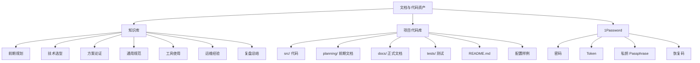
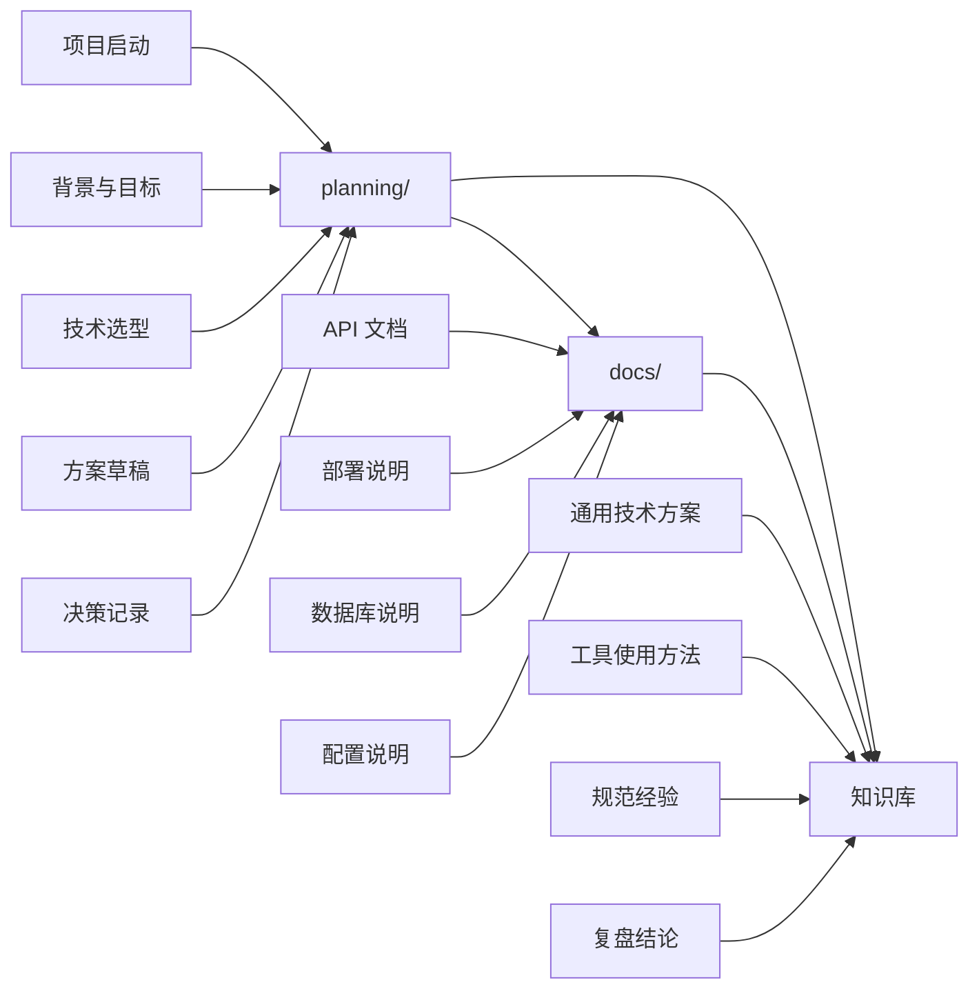
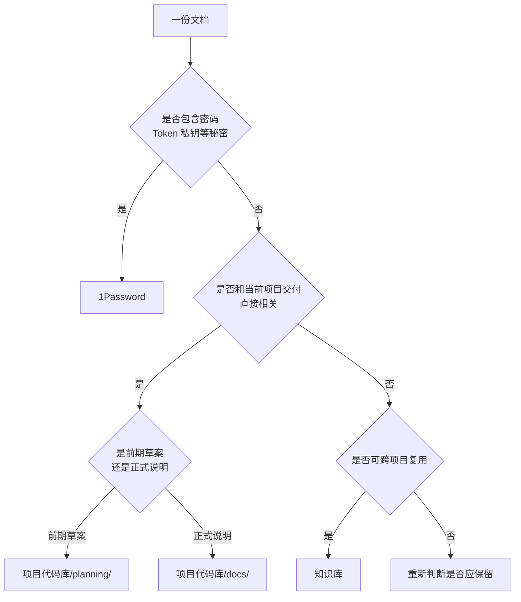

# 仓库与文档管理总则

## 0. 图形总览

### 0.1 仓库分类



### 0.2 文档流转



### 0.3 快速判断



## 1. 总体结构

只保留两类仓库：

- 知识库
- 项目代码库

## 2. 知识库放什么

知识库保存长期沉淀、可复用、跨项目有价值的内容。

适合放入知识库：

- 前期规划
- 技术选型
- 方案论证
- 架构思路
- 通用规范
- 工具使用方法
- 运维经验
- 复盘总结
- 从项目中提取出的通用知识

判断标准：

> 换一个项目以后仍然值得看，就放知识库。

## 3. 项目代码库放什么

项目代码库保存和当前项目交付直接相关的内容。

适合放入项目代码库：

- 程序代码
- `README.md`
- API 文档
- 部署说明
- 数据库说明
- 配置样例
- 测试代码
- 运行脚本
- 当前项目特有的交付文档

判断标准：

> 这个项目现在怎么开发、怎么运行、怎么部署、怎么交付，就放项目代码库。

## 4. 项目代码库目录建议

推荐保留两个文档目录：

- `planning/`
- `docs/`

含义如下：

- `planning/`：前期文档，放背景、目标、选型、方案草稿、决策记录。
- `docs/`：正式文档，放 API、部署、数据库、配置、运行说明。

推荐结构：

```text
project-repo/
  src/
  tests/
  planning/
    背景与目标.md
    技术选型.md
    方案草稿.md
    决策记录.md
  docs/
    api.md
    deploy.md
    database.md
    env.md
  README.md
  .env.example
```

## 5. 文档流转原则

项目前期允许文档和代码放在同一个项目代码库中，以提高推进效率。

项目推进过程中遵循以下流转：

1. 前期规划、选型、方案先写在项目代码库的 `planning/`。
2. 与当前运行和交付直接相关的内容整理进 `docs/`。
3. 从项目中提炼出的通用方案、工具方法、规范经验，再进入知识库。

## 6. 不应提交的内容

以下内容不进入知识库，也不进入项目代码库：

- 密码
- token
- 私钥
- 生产密钥
- 真实配置文件
- 数据库备份
- 日志文件
- 缓存文件
- 构建产物

秘密统一保存到 1Password。

## 7. 快速判断

```text
长期复用 -> 知识库
当前交付 -> 项目代码库
前期草案 -> planning/
正式说明 -> docs/
真正的秘密 -> 1Password
```
