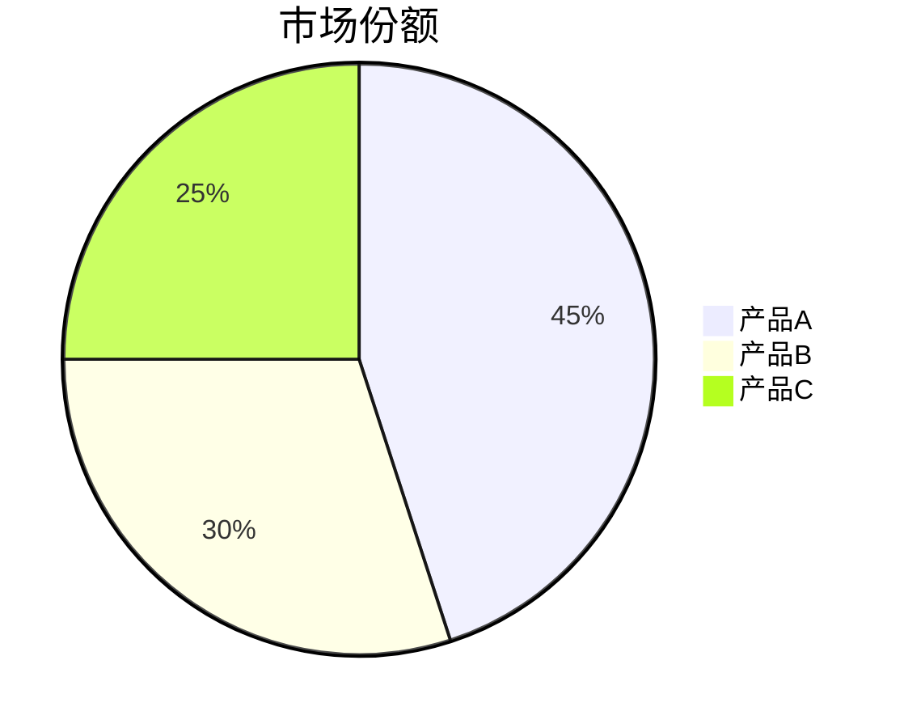

# 工具选型与技术方案整理

> 整理时间：2026-06-22  
> 来源：Coolify、Obsidian、笔记工具、图床与静态站点相关讨论

---

## 目录（大纲）

本文将依次展开讲解以下内容：

1. **Coolify 域名接入与反向代理** —— 自定义域名配置、Nginx Proxy Manager 端口映射、常见错误排查（502/521）
2. **Cloudflare + Coolify 521 错误排查** —— 根因定位、端口检查清单、防火墙与代理修复、ebm001.com 实际案例分析
3. **笔记工具选型对比** —— MarginNote 4、Obsidian、DEVONthink、GoodNotes 四者核心特点、适用场景、组合工作流
4. **Obsidian + Git 工作流** —— 插件与命令行实现方式、.gitignore 配置、与官方 Sync 对比
5. **Markdown 搭配图表** —— Obsidian 内图表方案（Charts、Mermaid、Chart.js）、MDX 嵌入、GitHub 渲染局限
6. **PicList + Cloudflare R2 图床** —— 免费额度、S3 兼容配置、注意事项
7. **Quartz 实时发布方案** —— GitHub Pages 自动部署 vs Coolify + Docker 自主部署（含 Dockerfile 示例）
8. **Git 平台浏览 vs 完整网站** —— 能替代什么、不能替代什么、何时需要 Quartz/Obsidian Publish
9. **快速选择速查表** —— 按问题直接查答案，一页纸对照

---


## 一、Coolify 域名接入与反向代理

### 1.1 接入自定义域名

1. **DNS 解析**：将域名 A 记录指向 Coolify 服务器公网 IP  
   `your-domain.com → A记录 → 1.2.3.4`
2. **Coolify 配置**：进入 Resource → Settings → Domains，填入域名（如 `app.your-domain.com`）
3. **开启 HTTPS**：在同一页面勾选 SSL / Let's Encrypt，Coolify 自动申请并续期证书

### 1.2 反向代理端口映射（Nginx Proxy Manager）

| 配置项 | 说明 |
|--------|------|
| **Port** | 容器内部端口（如 `3000`、`8080`） |
| **Expose Port** | 一般**不需要手动映射**，由 Nginx Proxy Manager 自动反向代理 |

**推荐做法**：只暴露容器内部端口，让 NPM 自动将外部 `80/443` 映射到容器端口。

### 1.3 常见问题排查

| 问题 | 原因 | 解决 |
|------|------|------|
| 域名无法访问 | DNS 未生效 | `dig your-domain.com` 检查 |
| 502 Bad Gateway | 容器未暴露内部端口 | 检查 Dockerfile `EXPOSE` 或应用监听端口 |
| 521 错误 | Cloudflare 代理模式下源服务器 80/443 未响应 | 检查 Coolify 代理容器是否运行，防火墙是否放行 |

---

## 二、Cloudflare + Coolify 521 错误排查

### 2.1 根因定位

Cloudflare 代理模式（橙色云）只连接源服务器的 **80 或 443 端口**，如果这两个端口无响应，则返回 521。

### 2.2 检查清单

```bash
# 检查端口监听
sudo ss -tlnp | grep :80
sudo ss -tlnp | grep :443

# 检查 Coolify 代理容器
docker ps | grep -E 'proxy|nginx|traefik'

# 检查防火墙
sudo ufw status
sudo ufw allow 80/tcp
sudo ufw allow 443/tcp
```

### 2.3 修复步骤

1. **启动代理容器**：
   ```bash
   cd /data/coolify
   docker compose up -d
   docker compose ps
   ```
2. **检查 Cloudflare SSL 模式**：
   - 源服务器有 HTTPS → **Full (strict)**
   - 源服务器只有 HTTP → **Flexible**（或修复源证书）
3. **防火墙放行 Cloudflare IP 段**（或临时允许所有 80/443）

### 2.4 实际案例（ebm001.com）

| 记录 | 状态 | 说明 |
|------|------|------|
| `coolify.ebm001.com` → `13.140.158.124` | 正确 | 子域名指向 Coolify 服务器 |
| 根域名 `ebm001.com` | 缺失 | 需补充 A 记录 |
| `www.ebm001.com` | 缺失 | 需补充 CNAME 或 A 记录 |

**建议补充**：
```
A     ebm001.com      13.140.158.124   已代理
CNAME www.ebm001.com  ebm001.com       已代理
```

---

## 三、笔记工具选型对比

### 3.1 MarginNote 4

| 维度 | 说明 |
|------|------|
| **核心定位** | 阅读 + 标注 + 思维导图 + 复习工具 |
| **最佳载体** | PDF / EPUB 出版物 |
| **核心动作** | 读 → 标 → 导图 → 卡片 → 复习 |
| **思维导图** | 标注自动生成，可拖拽调整结构 |
| **记忆卡片** | 支持导出 Anki，内置复习 |
| **手写体验** | 原生支持，但非核心卖点 |
| **平台** | **仅苹果生态**（iOS / iPadOS / macOS） |
| **适用人群** | 大学生、研究生、备考党、科研人员 |

### 3.2 Obsidian

| 维度 | 说明 |
|------|------|
| **核心定位** | 知识管理 + 第二大脑 + 长期写作 |
| **最佳载体** | Markdown 文本笔记 |
| **核心动作** | 写 → 链 → 整理 → 检索 → 输出 |
| **双向链接** | `[[Wiki链接]]` 构建知识网络 |
| **图谱视图** | 全局可视化笔记关联 |
| **插件生态** | 极丰富（Kanban、Dataview、Excalidraw、Git 等） |
| **平台** | **全平台**（Win / Mac / Linux / iOS / Android） |
| **数据存储** | 本地纯文本文件，完全可控 |
| **适用人群** | 知识工作者、作家、博主、深度研究者 |

### 3.3 DEVONthink

| 维度 | 说明 |
|------|------|
| **核心定位** | 文档数据库 + 私人搜索引擎 |
| **最佳载体** | 一切格式（PDF、邮件、网页、图片、Office） |
| **核心动作** | 存 → 搜 → 关联 → 取证 → 输出报告 |
| **AI 关联** | 自动发现文档间相似性（See Also） |
| **检索能力** | 全文搜索、布尔逻辑、离线索引 |
| **平台** | **仅苹果生态** |
| **与 MarginNote 区别** | MarginNote 是"读一本书"，DEVONthink 是"管理一千份文件" |
| **与 Obsidian 区别** | DEVONthink 是"文档容器"，Obsidian 是"文本网络" |
| **适用人群** | 研究者、律师、记者、档案管理者 |

### 3.4 GoodNotes

| 维度 | 说明 |
|------|------|
| **核心定位** | 手写笔记 / 电子笔记本 |
| **最佳载体** | 空白纸张 / 模板 |
| **核心动作** | 写、画、排版、整理 |
| **手写体验** | ⭐⭐⭐⭐⭐ 顶级，模拟真实纸张 |
| **PDF 阅读** | 可做批注，但非强项 |
| **思维导图** | ❌ 无 |
| **记忆卡片** | ❌ 无 |
| **平台** | iOS / macOS / Windows / Android 网页 |
| **与 MarginNote 区别** | GoodNotes = "写字画画"；MarginNote = "读书结构化" |
| **适用人群** | 学生课堂笔记、手账、设计手绘、草稿演算 |

### 3.5 四者对比总表

| 工具 | 核心范式 | 本质定位 | 核心动作 | 平台 | 一句话 |
|------|---------|---------|---------|------|--------|
| **MarginNote** | PDF/EPUB 阅读器 | 学习阅读工具 | 读 → 标 → 导图 → 卡片 | 苹果 | 把一本书嚼碎背下来 |
| **DEVONthink** | 文档数据库 | 数字档案库 | 存 → 搜 → 关联 → 输出 | 苹果 | 管理一千份文件并随时搜到 |
| **Obsidian** | Markdown 图谱 | 创作工作空间 | 写 → 链 → 整理 → 发布 | 全平台 | 把碎片念头连成知识网络 |
| **GoodNotes** | 手写笔记本 | 电子草稿本 | 写、画、排版 | 多平台 | 精致纸笔体验，想写就写 |

### 3.6 组合工作流建议

```
DEVONthink（收件箱/档案馆）
    ← 保存原始文献、网页、邮件、扫描件
    ↓
MarginNote（阅读室）
    ← 从 DEVONthink 打开 PDF 精读、标注、做导图
    ↓
Obsidian（工作室）
    ← 把结论用自己的话写成 Markdown 笔记，用 [[链接]] 连成理论
    ↓
Quartz（发布台）
    ← 把知识体系发布为网站，随时查阅
```

**原则**：DEVONthink 存**原件**，MarginNote 做**加工**，Obsidian 出**作品**。

---

## 四、Obsidian + Git 工作流

### 4.1 为什么绝配

| 特性 | 说明 |
|------|------|
| 纯文本 | Markdown 是 Git 的"母语"，diff 对比极清晰 |
| 本地优先 | 整个仓库 = `.obsidian` 配置 + `.md` 笔记 |
| 历史回溯 | 每次修改都有记录，误删可恢复 |
| 远程备份 | 推送到 GitHub/GitLab = 免费云备份 |
| 跨设备同步 | 新电脑 `git clone` 即可 |

### 4.2 实现方式

#### 方式一：Obsidian Git 插件（推荐）

1. 安装 **Obsidian Git** 插件
2. 配置：
   - 自动提交间隔：5 分钟或关闭文件时
   - 自动推送：推送到 GitHub 等远程仓库
3. 快捷键：`Ctrl+P` → `Obsidian Git: Create backup`

#### 方式二：命令行（极简控制）

```bash
# 日常 workflow
git add .
git commit -m "2025-01-15 工作笔记"
git push origin main
```

### 4.3 .gitignore 建议

```gitignore
# 工作区缓存（每台电脑不同）
.obsidian/workspace.json
.obsidian/workspace-mobile.json

# 插件缓存和临时文件
.obsidian/plugins/*/data.json
.obsidian/cache

# 系统文件
.DS_Store
Thumbs.db
```

**保留**：`.obsidian/snippets/`、`.obsidian/themes/` 以同步主题和 CSS 片段。

### 4.4 对比 Obsidian 官方 Sync

| 维度 | Obsidian Git | 官方 Sync |
|------|-------------|----------|
| 价格 | 免费 | 月费/年费 |
| 历史版本 | 无限 | 有限 |
| 冲突处理 | Git 原生合并（精确到行） | 自动覆盖 |
| 移动端 | 需 Working Copy（iOS）/ GitJournal（Android） | 原生支持 |
| 大文件/图片 | 需 Git LFS 或外部图床 | 不限大小 |

---

## 五、Markdown 搭配图表

### 5.1 在 Obsidian 中显示图表

| 方案 | 工具 | 说明 |
|------|------|------|
| **简单图表** | Obsidian Charts 插件 | YAML 格式定义，无需写 JS |
| **复杂图表** | CustomJS + Chart.js | 需要本地加载 Chart.js 库 |
| **原生支持** | Mermaid 语法 | 流程图、时序图、甘特图、饼图等 |

#### Obsidian Charts 示例

```markdown
```chart
type: line
labels: [Jan, Feb, Mar, Apr, May]
series:
  - title: 收入
    data: [120, 200, 150, 80, 250]
```

#### Mermaid 示例

```markdown


### 5.2 在网页/博客中（MDX）

```mdx
import { Chart } from 'chart.js/auto';
<canvas id="chart"></canvas>
<script>
  new Chart(document.getElementById('chart'), {
    type: 'line',
    data: { labels: ['Jan','Feb'], datasets: [{ data: [10, 20] }] }
  });
</script>
```

### 5.3 GitHub 原生渲染的局限

GitHub 只能解析**标准 Markdown**，以下 Obsidian 语法会**失效**：

| Obsidian 语法 | GitHub 效果 |
|-------------|------------|
| `[[双向链接]]` | 普通文本，不可点击 |
| `![[嵌入笔记]]` | 显示为语法文本 |
| `%%注释%%` | 直接显示 |
| Dataview 查询 | 显示代码块，不执行 |
| Excalidraw 画布 | 显示 JSON 或二进制，无法查看 |

**结论**：GitHub 能看"文章"，看不了"知识图谱"。

---

## 六、PicList + Cloudflare R2 图床

### 6.1 R2 免费额度（每月）

| 项目 | 免费额度 | 超出后 |
|------|---------|--------|
| 存储 | 10 GB | ~$0.015/GB/月 |
| Class A 操作（上传） | 100 万次 | 极低费率 |
| Class B 操作（下载） | 1000 万次 | 极低费率 |
| **流量/带宽 (Egress)** | **无限免费** | 永远免费 |

**关键卖点**：无流量费，即使被大量访问也不收费。

### 6.2 PicList 配置

| 配置项 | 值 |
|--------|-----|
| 存储类型 | Amazon S3（S3 兼容） |
| Endpoint | `https://<账户ID>.r2.cloudflarestorage.com` |
| Bucket | 你的存储桶名称 |
| Region | `auto` 或 `us-east-1` |
| Access Key | R2 生成的 S3 令牌 |
| Secret Key | 对应密钥 |
| 自定义域名 | 可选（如 `img.ebm001.com`） |

### 6.3 注意事项

1. 需绑定信用卡/PayPal 才能开通 R2，但免费额度内不扣费
2. 建议设置自定义域名，默认地址 `pub-xxx.r2.dev` 不友好
3. 存储桶需设为**公开可读**，否则图片无法直接访问
4. 国内访问速度取决于 Cloudflare 节点，不如国内 OSS 快

---

## 七、Quartz 实时发布方案

### 7.1 Quartz 是什么

静态站点生成器，将 Obsidian 的 Markdown 笔记变成**支持双向链接、图谱搜索、美观界面的网站**。

**核心特点**：
- 支持 `[[Wiki链接]]` 和图谱视图
- 全文搜索
- 自定义主题
- 可通过 GitHub Actions 或 Coolify 自动部署

### 7.2 方案 A：GitHub Pages + GitHub Actions（完全免费）

```
Obsidian 写作
    ↓ Obsidian Git 插件自动 commit + push
GitHub 仓库（源码）
    ↓ GitHub Actions 自动构建
Quartz 网站（GitHub Pages）
    ↓ 浏览器访问
xxx.github.io / 自定义域名
```

**部署步骤**：
1. 克隆 Quartz：`git clone https://github.com/jackyzha0/quartz.git`
2. 将 Obsidian 笔记放入 `content/` 目录
3. 配置 `.github/workflows/deploy.yml`（构建 + 部署 Pages）
4. 推送到 GitHub，开启 Pages 自动部署
5. （可选）绑定自定义域名，如 `wiki.ebm001.com`

### 7.3 方案 B：Coolify + Docker 部署（自主可控）

#### Dockerfile 示例

```dockerfile
# 构建阶段
FROM node:20-alpine AS builder
WORKDIR /app
COPY package*.json ./
RUN npm ci
COPY . .
RUN npx quartz build

# 运行阶段：Nginx 提供静态文件
FROM nginx:alpine
COPY --from=builder /app/public /usr/share/nginx/html
EXPOSE 80
```

#### Coolify 配置

| 配置项 | 值 |
|--------|-----|
| Build Pack | Dockerfile |
| Port | 80（Nginx 默认） |
| Domains | `wiki.ebm001.com` |
| SSL | 开启 |

#### 完整工作流

```
Obsidian 本地写作
    ↓ Obsidian Git 插件自动 push
GitHub/GitLab 仓库更新
    ↓ Coolify 自动拉取（Webhook 或轮询）
运行 docker build（quartz build）
    ↓ Nginx serve 静态文件
浏览器访问 wiki.ebm001.com（自动 HTTPS）
```

### 7.4 两种方案对比

| 维度 | GitHub Pages | Coolify |
|------|-------------|---------|
| 费用 | 免费 | 服务器费用 |
| 访问速度 | 国内慢 | 服务器在哪速度就在哪 |
| 数据控制 | 依赖 GitHub | 完全自主 |
| 构建时间 | 1-2 分钟 | 1-3 分钟 |
| 自定义域名 | 支持 | 完全自主 |
| 私密笔记 | 仓库可 Private，但内容公开 | 可内网部署，完全私有 |

### 7.5 注意事项

- **构建内存**：小内存 VPS（1GB）可能构建失败，建议至少 2GB，或本地构建后只上传 `public/` 目录
- **隐私保护**：`content/` 中不要放私密笔记，或用 `quartz.config.ts` 的 `ignorePatterns` 排除
- **图片附件**：确保图片在 Git 仓库中，Quartz 会自动处理 `![[图片.png]]` 格式
- **代理容器**：确保 Coolify 的 Nginx Proxy Manager 正常运行，否则域名无法访问

---

## 八、Git 平台浏览 vs 完整网站

### 8.1 Git 平台能替代的部分

| 功能 | 替代程度 |
|------|---------|
| 文件备份 | ✅ 完全替代 |
| 历史回溯 | ✅ 完全替代 |
| 跨设备同步 | ⚠️ 单向替代（需手动/脚本触发） |
| 基础 Markdown 预览 | ⚠️ 仅支持标准语法 |

### 8.2 Git 平台替代不了的部分

- **Obsidian 特色语法**：`[[双向链接]]`、`![[嵌入]]`、`%%注释%%`、Dataview 查询均失效
- **图谱视图**：无法在线查看知识网络
- **搜索体验**：弱于 Obsidian 本地搜索和 Quartz 网站搜索
- **移动端**：GitHub 网页版体验一般，无法离线浏览

### 8.3 结论

> **Git 平台替代了"存储"和"基础浏览"，但替代不了"知识图谱的可视化"和"Obsidian 特色功能的在线呈现"。**

如果希望在线也能点击链接、查看图谱、搜索笔记，必须使用 **Quartz、Obsidian Publish 或 Digital Garden** 等方案。

---

## 九、快速选择速查表

| 问题 | 答案 |
|------|------|
| 服务器上域名无法访问？ | 检查 Coolify 代理容器 `docker ps`，检查防火墙 80/443 |
| 521 错误？ | Cloudflare 代理连不上源服务器 80/443，检查端口和 SSL 模式 |
| 要读透一本 PDF 教材？ | **MarginNote** |
| 要管理一千份文件证据？ | **DEVONthink** |
| 要写书/构建知识网络？ | **Obsidian** |
| 要手写课堂笔记/草稿？ | **GoodNotes** |
| 笔记备份免费方案？ | **Obsidian + Git + GitHub 私有库** |
| 笔记免费在线发布？ | **Quartz + GitHub Pages** |
| 图床免费方案？ | **PicList + Cloudflare R2**（10GB 存储 + 无限流量） |
| 服务器自主发布笔记？ | **Quartz + Coolify + Docker** |

---

*文档完*
