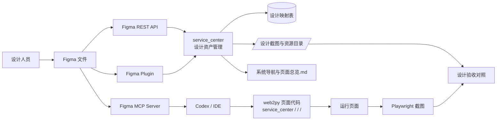
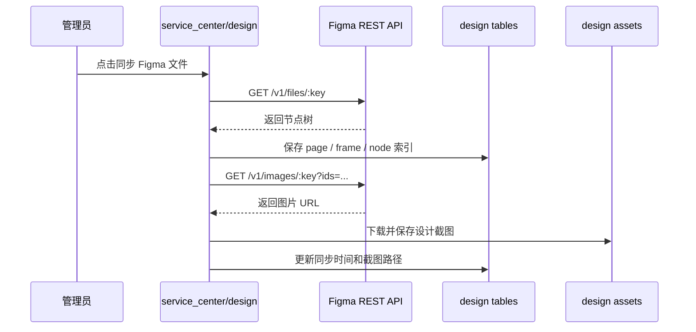
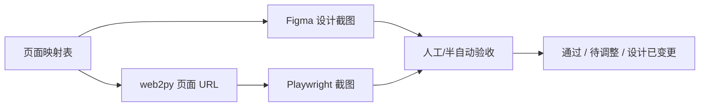

# Figma 集成方案

> 生成日期: 2026-06-15  
> 适用范围: web2py 服务平台、系统页面设计稿、页面验收和 AI 辅助开发  
> 关联文档: `../00-总览/系统架构与功能图.md`、`../00-总览/系统导航与页面总览.md`、`../00-总览/断点恢复与文档维护说明.md`

## 1. 目标

把 Figma 设计稿和 web2py 页面建立稳定映射，让系统从“页面已经做了但设计稿在哪里不清楚”变成:

```text
页面路由
  -> Figma 文件 / Frame / Node
  -> 设计状态
  -> 实现页面 URL
  -> 页面截图
  -> 验收记录
```

第一阶段不追求自动生成完整代码，优先解决设计稿可追踪、页面可验收、后续可自动化的问题。

## 2. 官方能力边界

| 能力 | 用途 | 适合本系统的用法 |
| --- | --- | --- |
| Figma REST API | 后端读取文件、节点、样式、组件和图片导出 | `service_center` 手动或定时拉取页面设计稿索引、导出 Frame 截图 |
| Figma Plugin API | 插件在 Figma 客户端内读取/写入画布 | 未来做“平台页面地图导入插件”，把系统页面清单反向生成低保真 Frame |
| Figma Webhooks | 监听文件、评论等变更事件 | 后续监听设计稿变化，触发截图刷新或验收提醒 |
| Figma MCP Server | 把 Figma 设计上下文给 AI 编码工具 | Codex/IDE 按设计稿修改 web2py 页面时使用 |

官方入口:

- REST API: `https://developers.figma.com/docs/rest-api/`
- File endpoints: `https://developers.figma.com/docs/rest-api/file-endpoints/`
- Image endpoints: `https://developers.figma.com/docs/rest-api/image-endpoints/`
- Webhooks: `https://developers.figma.com/docs/rest-api/webhooks/`
- Plugin API: `https://developers.figma.com/docs/plugins/`
- Figma MCP Server: `https://developers.figma.com/docs/figma-mcp-server/`

## 3. 推荐总体架构



## 4. 分阶段落地

### 4.1 第一阶段: 文档映射

目标: 不开发接口，先让页面和设计稿可以人工对应。

在 `../00-总览/系统导航与页面总览.md` 中登记:

| 字段 | 说明 |
| --- | --- |
| Figma 文件 | Figma file URL 或 file key |
| Figma 页面 | Figma Page 名称 |
| Figma Frame | Frame 名称 |
| Figma Node ID | 精确 node id |
| 设计状态 | 未设计、设计中、待评审、已确认、已废弃 |
| 设计截图 | 从 Figma 导出的设计图 |
| 实现截图 | Playwright 或人工截取的 web2py 页面图 |
| 验收状态 | 未验收、待调整、通过 |

### 4.2 第二阶段: service_center 设计资产管理

目标: 在平台后台集中维护 Figma 文件、Frame 和页面路由映射。

建议新增模块:

```text
applications/service_center/
  controllers/design.py
  models/design_db.py
  modules/figma_client.py
  views/design/
    index.html
    files.html
    page_map.html
    snapshots.html
```

建议新增页面:

| 页面 | URL | 用途 |
| --- | --- | --- |
| 设计资产首页 | `/service_center/design/index` | 查看接入状态和最近同步 |
| Figma 文件管理 | `/service_center/design/files` | 录入 file key、文件名、团队和状态 |
| 页面映射 | `/service_center/design/page_map` | 维护 web2py 路由与 Figma node 对应关系 |
| 设计截图 | `/service_center/design/snapshots` | 查看导出的 Frame 截图和实现截图 |
| 手动同步 | `/service_center/design/sync_file/<id>` | 拉取文件节点和导出图片 |

### 4.3 第三阶段: Figma API 同步

目标: 后台通过 REST API 拉取文件结构和导出 Frame 图片。

同步流程:



### 4.4 第四阶段: 自动截图和验收

目标: 对核心页面建立设计截图和实现截图的对照。



第一版建议人工验收，后续再做像素差异或规则检查。对业务系统来说，导航、字段、按钮、表格密度和响应式状态通常比像素完全一致更重要。

### 4.5 第五阶段: MCP 辅助开发

目标: 让 Codex/IDE 读取 Figma 上下文，按设计稿修改 web2py 页面。

适用场景:

- 根据 Figma Frame 实现新页面。
- 对照设计稿修正现有页面布局。
- 读取颜色、字号、间距和组件层级。
- 生成页面验收清单。

MCP 不替代平台后台同步。后台同步负责资产治理，MCP 负责开发时理解设计上下文。

## 5. 建议数据模型

### 5.1 `design_source`

Figma 文件来源。

| 字段 | 类型 | 说明 |
| --- | --- | --- |
| `source_type` | string | 固定为 `figma`，后续可扩展 `js_design` |
| `file_key` | string | Figma file key |
| `file_url` | string | Figma 文件 URL |
| `file_name` | string | 文件名 |
| `team_name` | string | 团队或项目名 |
| `status` | string | active / archived |
| `last_synced_on` | datetime | 最近同步时间 |
| `created_by` | reference auth_user | 创建人 |

### 5.2 `design_node`

Figma 文件中的 Page、Frame 或组件节点。

| 字段 | 类型 | 说明 |
| --- | --- | --- |
| `source_id` | reference design_source | 所属文件 |
| `node_id` | string | Figma node id |
| `node_name` | string | 节点名称 |
| `node_type` | string | DOCUMENT / CANVAS / FRAME / COMPONENT 等 |
| `parent_node_id` | string | 父节点 |
| `path` | string | 页面路径 |
| `thumbnail_path` | string | 导出的缩略图 |
| `raw_json` | text | 节点摘要，避免保存过大的完整 JSON |

### 5.3 `design_page_map`

web2py 页面和 Figma 节点映射。

| 字段 | 类型 | 说明 |
| --- | --- | --- |
| `app_name` | string | `service_center`、`<business_app>`、`<quality_app>` 等 |
| `controller` | string | web2py controller |
| `function_name` | string | web2py function |
| `route_url` | string | 实际 URL |
| `source_id` | reference design_source | Figma 文件 |
| `node_id` | string | Figma Frame node id |
| `figma_page_name` | string | Figma 页面名 |
| `figma_frame_name` | string | Frame 名 |
| `design_status` | string | not_started / designing / review / approved / deprecated |
| `implementation_status` | string | not_started / in_progress / implemented / accepted |
| `review_status` | string | not_reviewed / needs_changes / passed |

### 5.4 `design_snapshot`

设计截图和实现截图。

| 字段 | 类型 | 说明 |
| --- | --- | --- |
| `page_map_id` | reference design_page_map | 对应页面映射 |
| `snapshot_type` | string | figma / implementation |
| `viewport` | string | desktop / mobile / tablet |
| `image_path` | string | 本地保存路径 |
| `source_version` | string | Figma version 或同步批次 |
| `captured_on` | datetime | 截图时间 |
| `captured_by` | reference auth_user | 操作人 |

## 6. 配置与密钥管理

Figma token 不能提交到 Git。

建议配置路径:

```text
/data/<web2py_service>/service_center/config/figma.ini
```

配置示例:

```ini
[figma]
api_base = https://api.figma.com
access_token = replace-with-token
download_timeout = 30
asset_root = /data/<web2py_service>/service_center/design_assets
```

代码目录只保留模板:

```text
applications/service_center/private/figma.ini.example
```

安全要求:

- 使用只读 token 起步。
- token 文件权限仅限运行用户可读。
- 后台页面不显示完整 token。
- 同步日志不打印 token。
- 设计截图如含客户信息，按内部资料管理。

## 7. 文件目录

建议保存设计资产到:

```text
/data/<web2py_service>/service_center/design_assets/
  figma/
    <file_key>/
      nodes/
      screenshots/
      manifests/
```

文档内只记录相对索引，不直接嵌入大图片。

## 8. 页面总览字段规范

`../00-总览/系统导航与页面总览.md` 中的核心页面应补充:

| 字段 | 示例 |
| --- | --- |
| Figma 文件 | `https://www.figma.com/design/<file_key>/...` |
| Figma Node ID | `12:345` |
| Frame 名称 | `业务系统 / 产品档案 / Desktop` |
| 设计状态 | `已确认` |
| 实现状态 | `已实现` |
| 验收状态 | `待调整` |

命名建议:

```text
<app> / <controller> / <function> / <viewport>
```

示例:

```text
<business_app> / master_data / products / desktop
<quality_app> / capture / inspect / mobile
<report_app> / default / dashboard / desktop
```

## 9. 与当前文档的关系

| 文档 | 维护内容 |
| --- | --- |
| `../00-总览/系统架构与功能图.md` | 增加设计资产管理属于 `service_center` 平台能力 |
| `../00-总览/系统导航与页面总览.md` | 每个核心页面登记 Figma 映射、截图和验收状态 |
| `../00-总览/断点恢复与文档维护说明.md` | 增加 Figma 文档和恢复步骤 |
| `软件系统规范化设计执行清单.md` | 将 Figma 从后期工具变成可选设计源 |

## 10. 最小可行版本

第一版只做文档和手动映射:

- [x] 新建本方案文档。
- [x] 在页面总览中加入 Figma 映射字段。
- [ ] 为 5 个核心页面手工登记 Figma 文件、Frame 和 Node ID。
- [ ] 从 Figma 手工导出 5 张设计截图。
- [ ] 用浏览器或 Playwright 截 5 张实现截图。
- [ ] 在页面总览中记录验收状态。

第二版再开发 `service_center/design` 后台模块和 Figma REST API 同步。

## 11. 后续待确认

1. 公司是否已经有 Figma 组织空间和可用开发 token。
2. 设计稿命名是否按 app/controller/function 组织。
3. 设计截图是否允许保存在服务器本地。
4. 是否需要把设计资产管理作为系统后台菜单项。
5. Figma MCP 由开发人员本地使用，还是统一部署在服务器环境。
