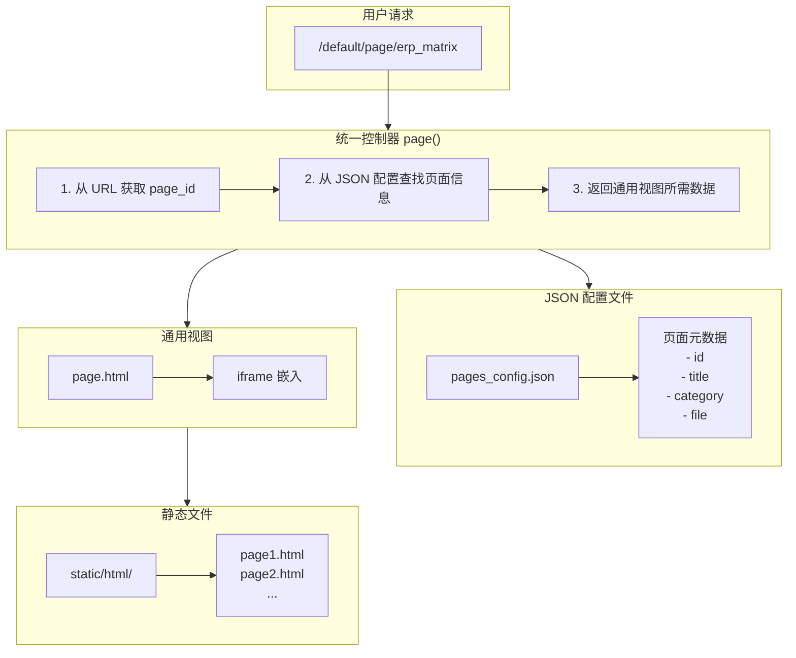
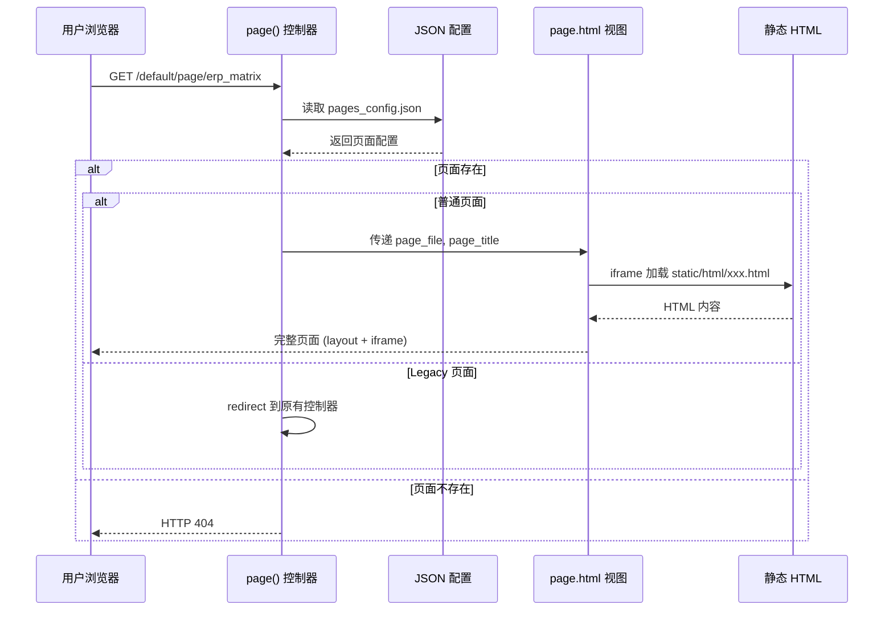
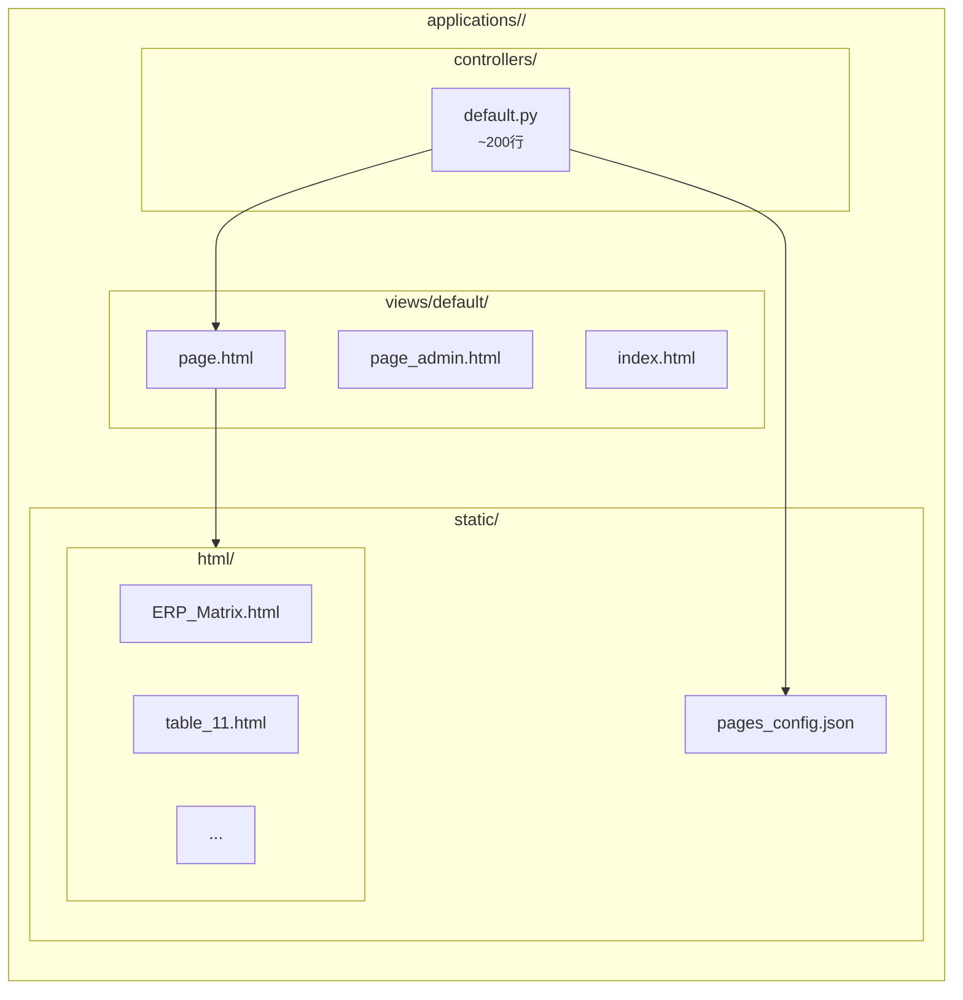
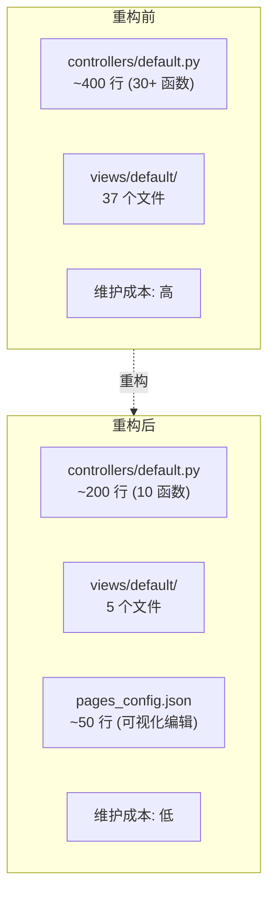
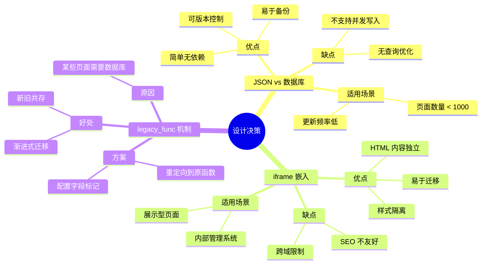
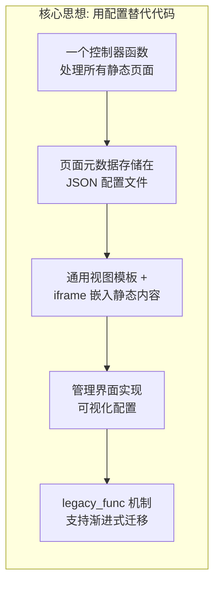
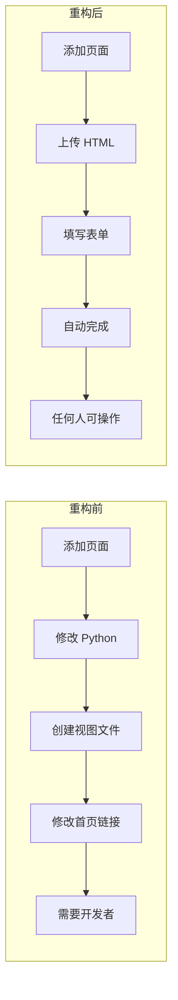

# Web2py 统一控制器模式教学文档

## 1. 问题背景：硬编码方式的痛点

### *1.1* 传统硬编码方式

在重构之前，每添加一个新页面需要：

```python
# controllers/default.py - 旧方式
# 每个页面需要一个独立的控制器函数

def table_11():
    response.title = '冲压件项目全流程管理总表'
    return dict()

def table_12():
    response.title = '另一个页面'
    return dict()

def table_13():
    response.title = '又一个页面'
    return dict()

# ... 重复 30+ 次
```

同时需要对应的视图文件：
```
views/default/
├── table_11.html
├── table_12.html
├── table_13.html
└── ... (30+ 个文件)
```

### 1.2 痛点分析

| 问题 | 影响 |
|------|------|
| 代码重复 | 每个函数结构几乎相同，只是标题不同 |
| 维护困难 | 添加新页面需要修改 Python 代码 |
| 分类管理 | 无法动态管理页面分类 |
| 非技术人员 | 无法自行添加页面，依赖开发者 |

---

## 2. 解决方案：统一控制器模式

### 2.1 架构概览



### 2.2 请求处理流程



### 2.3 核心文件结构



---

## 3. 代码详解

### 3.1 配置文件结构 (pages_config.json)

```json
{
  "categories": [
    "系统管理",
    "产品管理",
    "项目管理"
  ],
  "pages": [
    {
      "id": "erp_matrix",           // 唯一标识，用于 URL
      "title": "系统全量表单",        // 页面标题
      "category": "系统管理",        // 所属分类
      "file": "ERP_Matrix.html"     // 对应的静态文件
    },
    {
      "id": "bom",
      "title": "零部件产品管理",
      "category": "产品管理",
      "legacy_func": "BOM"          // 特殊：使用旧控制器（需数据库）
    }
  ]
}
```

### 3.2 配置管理工具函数

```python
import json
import os

def _get_config_path():
    """
    获取配置文件的绝对路径

    request.folder: web2py 提供的应用根目录
    返回: /path/to/app/static/pages_config.json
    """
    return os.path.join(request.folder, 'static', 'pages_config.json')


def _load_config():
    """
    加载页面配置

    设计要点：
    1. 使用 try-except 确保即使文件不存在也能返回有效结构
    2. 返回空配置而非抛异常，提高系统健壮性
    """
    config_path = _get_config_path()
    try:
        with open(config_path, 'r', encoding='utf-8') as f:
            return json.load(f)
    except:
        # 文件不存在或解析失败时返回空配置
        return {"categories": [], "pages": []}


def _save_config(config):
    """
    保存页面配置

    参数说明：
    - ensure_ascii=False: 保留中文字符（不转义为 \uXXXX）
    - indent=2: 格式化输出，便于人工编辑
    """
    config_path = _get_config_path()
    with open(config_path, 'w', encoding='utf-8') as f:
        json.dump(config, f, ensure_ascii=False, indent=2)
```

### 3.3 统一页面控制器 (核心)

```python
def page():
    """
    统一页面控制器 - 替代 30+ 个独立函数

    URL 模式: /default/page/{page_id}
    示例: /default/page/erp_matrix
    """

    # ========== 步骤 1: 获取 URL 参数 ==========
    # request.args(0) 获取 URL 中的第一个参数
    # /default/page/erp_matrix → page_id = "erp_matrix"
    page_id = request.args(0)

    if not page_id:
        # 未提供 page_id 时重定向到管理页面
        redirect(URL('default', 'page_admin'))

    # ========== 步骤 2: 查找页面配置 ==========
    config = _load_config()
    page_info = None

    # 遍历查找匹配的页面
    for p in config.get('pages', []):
        if p['id'] == page_id:
            page_info = p
            break

    # 页面不存在时返回 404
    if not page_info:
        raise HTTP(404, '页面不存在')

    # ========== 步骤 3: 处理 Legacy 页面 ==========
    # 某些页面需要数据库查询，无法使用静态 HTML
    # 通过 legacy_func 字段标记，重定向到原有控制器
    if 'legacy_func' in page_info:
        redirect(URL('default', page_info['legacy_func']))

    # ========== 步骤 4: 返回视图数据 ==========
    response.title = page_info['title']

    # 这些数据将传递给 views/default/page.html
    return dict(
        page_id=page_id,
        page_title=page_info['title'],
        page_file=page_info['file'],      # iframe 将加载此文件
        page_category=page_info['category']
    )
```

### 3.4 通用视图模板 (page.html)

```html
{{extend 'layout.html'}}

<!--
    通用页面视图

    作用: 在统一的布局中嵌入静态 HTML 内容

    变量来源 (由 page() 控制器传入):
    - page_file: 静态 HTML 文件名
    - page_title: 页面标题 (用于 iframe title 属性)
-->

<div class="iframe-page">
    <!--
        iframe 嵌入方式的优势:
        1. 静态 HTML 保持独立，可单独编辑
        2. 自动继承 layout.html 的导航菜单
        3. 隔离样式，避免冲突

        URL 生成: URL('static', 'html/' + page_file)
        结果: /static/html/ERP_Matrix.html
    -->
    <iframe
        src="{{=URL('static', 'html/' + page_file)}}"
        title="{{=page_title}}"
        loading="lazy">
    </iframe>
</div>
```

### 3.5 首页控制器 (分类展示)

```python
def index():
    """
    首页 - 从 JSON 配置读取并分类展示所有页面

    功能:
    1. 读取所有页面配置
    2. 按 category 分组
    3. 区分普通页面和 legacy 页面
    4. 检查文件是否存在
    """
    response.title = '示例项目管理平台'

    config = _load_config()
    pages_list = config.get('pages', [])

    # ========== 按分类分组 ==========
    categories = {}  # { "系统管理": [page1, page2], "产品管理": [...] }

    for page in pages_list:
        category = page['category']

        # 初始化分类数组
        if category not in categories:
            categories[category] = []

        # 复制页面信息（避免修改原数据）
        page_copy = page.copy()

        # ========== 区分页面类型 ==========
        if 'legacy_func' in page:
            # Legacy 页面: 使用旧控制器函数
            # URL: /default/BOM
            page_copy['func'] = page['legacy_func']
            page_copy['use_legacy'] = True
            page_copy['exists'] = True
        else:
            # 普通页面: 使用统一控制器
            # URL: /default/page/erp_matrix
            page_copy['func'] = 'page'
            page_copy['args'] = page['id']
            page_copy['use_legacy'] = False

            # 检查静态文件是否存在
            page_copy['exists'] = os.path.exists(
                os.path.join(request.folder, 'static', 'html', page.get('file', ''))
            )

        categories[category].append(page_copy)

    return dict(categories=categories)
```

---

## 4. 新旧方式对比

### 4.1 添加新页面的流程对比

| 步骤 | 旧方式 (硬编码) | 新方式 (统一控制器) |
|------|----------------|-------------------|
| 1 | 编辑 default.py | 上传 HTML 文件 |
| 2 | 添加新函数 | 填写页面信息 |
| 3 | 创建视图文件 | (自动完成) |
| 4 | 修改首页链接 | (自动完成) |
| 5 | 重启服务器 | 无需重启 |
| 所需技能 | Python 开发 | 仅需浏览器操作 |

### 4.2 代码量对比



---

## 5. 设计模式解析

### 5.1 应用的设计原则

| 原则 | 应用方式 |
|------|---------|
| **DRY** (Don't Repeat Yourself) | 一个 page() 函数替代 30+ 个相似函数 |
| **配置与代码分离** | 页面元数据存储在 JSON 而非 Python |
| **开闭原则** | 添加新页面无需修改代码，只需修改配置 |
| **单一职责** | page() 只负责路由，page_admin() 只负责管理 |

### 5.2 关键设计决策



---

## 6. API 接口说明

### 6.1 页面管理 API

| 端点 | 方法 | 功能 | 参数 |
|------|------|------|------|
| `/default/page/{id}` | GET | 访问页面 | id: 页面标识 |
| `/default/page_admin` | GET | 管理界面 | - |
| `/default/page_upload` | POST | 上传新页面 | page_id, page_title, page_category, html_file |
| `/default/page_update` | POST | 更新页面 | old_page_id, page_id, page_title, page_category |
| `/default/page_delete` | POST | 删除页面 | page_id |
| `/default/page_add_category` | POST | 添加分类 | category |

### 6.2 响应格式

```json
// 成功
{"success": true}

// 失败
{"success": false, "message": "错误原因"}
```

---

## 7. 扩展思考

### 7.1 可能的改进方向

1. **权限控制**: 添加 `@auth.requires_login()` 保护管理接口
2. **文件管理**: 添加删除/替换 HTML 文件的功能
3. **版本历史**: 记录配置变更历史
4. **搜索功能**: 添加全文搜索支持
5. **排序功能**: 支持页面顺序调整

### 7.2 适用场景

- 企业内部管理系统
- 文档展示平台
- 教学案例库
- 报表展示系统

---

## 8. 总结

统一控制器模式通过以下方式简化了 Web2py 应用的维护：



### 效果对比



这种模式将"添加新页面"从开发[任务]()转变为配置任务，大幅降低了维护成本。
