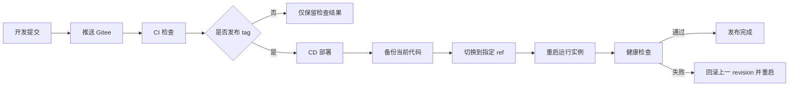

# CI/CD 标准流程方案

> 生成日期: 2026-06-15  
> 更新日期: 2026-06-23  
> 适用根目录: web2py 项目仓库；传统部署实例路径通常为 `/opt/<web2py_service>`  
> 部署原则: PaaS 平台优先评估，Coolify、自建 Docker/Compose 和传统 systemd + Nginx 均作为可选实现  
> 远程仓库: `git@gitee.com:<git-namespace>/<web2py-service>.git`

## 1. 目标

为 web2py 服务平台建立一套保守、可回滚、可审计的 CI/CD 流程。当前目标是先保证传统部署可控，再逐步接入合适的 PaaS 或部署平台。部署平台可以不同，但 CI 门禁、运行数据保护、备份、健康检查和回滚原则保持一致。第一版重点是:

- 代码和运行数据分离。
- 推送前和部署前做语法与敏感文件检查。
- 部署前备份当前代码版本。
- 部署只更新代码，不覆盖数据库、上传、会话、错误日志和生产配置。
- 部署后重启运行实例并做健康检查；PaaS/容器平台重启实例或重新部署，传统部署重启 `<web2py-service>.service`。
- 失败时回滚到部署前 Git revision。

## 2. 总体流程



## 3. 推荐分支和发布规则

| 分支/标签 | 用途 | 部署策略 |
| --- | --- | --- |
| `develop` | 日常开发和联调 | 不自动部署生产 |
| `master` / `main` | 可部署主线 | 可手动部署或自动部署到生产 |
| `vX.Y.Z` | 正式发布标签 | 推荐生产部署只认 tag |
| feature 分支 | 单功能开发 | 只跑 CI，不部署 |

发布建议:

```text
开发分支 -> 合并 master -> CI 通过 -> 打 vX.Y.Z tag -> CD 部署 tag
```

当前已有 Git 规范文档:

```text
applications/service_center/docs/git-update-rules-Git更新规则.md
applications/service_center/docs/git-operations-Git操作标准文档.md
```

## 4. CI 检查内容

脚本:

```text
scripts/ci_check.sh
```

默认检查活跃应用:

```text
service_center
<business_app>
<quality_app>
<report_app>
```

检查项:

| 检查项 | 说明 |
| --- | --- |
| Python 语法 | 对活跃 app 的 `controllers/`、`models/`、`modules/`、`scripts/` 执行 `py_compile` |
| Git 空白检查 | 执行 `git diff --check` |
| 禁止追踪运行数据 | 检查 Git 中是否包含数据库、上传、会话、错误、缓存、真实配置 |
| 运行软链接策略 | 检查运行目录软链接是否指向 `/data/<web2py_service>`，且软链接本身未被 Git 跟踪 |
| Markdown 围栏 | 检查系统文档中的 ``` 围栏是否成对 |
| 配置模板 | 检查重点 app 的配置模板是否存在 |

本地执行:

```bash
cd /opt/<web2py_service>
scripts/ci_check.sh
```

检查全部 app:

```bash
scripts/ci_check.sh --all-apps
```

## 5. CD 部署内容

CD 分为两条执行路径:

| 路径 | 适用场景 | 执行方式 | 状态 |
| --- | --- | --- | --- |
| 云服务商 PaaS | 新部署、试点、希望外包平台运维能力的项目 | CI 通过后由 PaaS 平台拉取仓库、镜像或构建产物部署 | 优先评估 |
| Coolify / Docker Compose | 需要自托管 PaaS 或标准 Compose 编排的项目 | CI 通过后由 Coolify 或 Docker Compose 拉取仓库/镜像并部署 | 可选路径 |
| 传统 systemd + Nginx | 存量项目、未完成容器化的项目、短期回滚通道 | 通过受控部署脚本更新 `/opt/<web2py_service>` 并重启 systemd 服务 | 兼容路径 |

### 5.1 PaaS / Docker Compose 部署

推荐仓库提供平台中立的部署材料。云服务商 PaaS 可以使用其原生构建能力；Coolify 或自建环境可以使用 Docker/Compose:

```text
Dockerfile
docker-compose.yml
.env.example
```

部署动作:

1. 确认工作区干净。
2. 运行 `scripts/ci_check.sh`。
3. 构建镜像、打包产物，或由目标 PaaS 平台构建。
4. 按目标平台方式部署服务。
5. 确认数据库、上传文件和运行配置已映射到持久化存储。
6. 检查实例健康状态。
7. 对公网 URL 做健康检查。
8. 失败时回滚到上一镜像、上一 tag 或上一 Compose 配置。

### 5.2 传统 systemd 部署

脚本:

```text
scripts/deploy_<web2py_service>.sh
```

默认是 dry-run，不会改动服务器:

```bash
scripts/deploy_<web2py_service>.sh --ref origin/master
```

真正执行部署必须显式加 `--execute`:

```bash
sudo scripts/deploy_<web2py_service>.sh --execute --ref origin/master
sudo scripts/deploy_<web2py_service>.sh --execute --ref v1.2.3
```

部署动作:

1. 确认工作区干净。
2. 运行 `scripts/ci_check.sh`。
3. 记录当前 Git revision。
4. 备份当前代码到 `/data/<web2py_service>/backups/deploy/`。
5. `git fetch --tags origin`。
6. 切换到目标 ref。
7. 重跑 CI 检查。
8. 重启 `<web2py-service>.service`。
9. 检查服务状态。
10. 对本地 URL 做健康检查。
11. 失败时回滚部署前 revision。

## 6. 运行数据保护

以下路径不能进入 Git，也不能被部署脚本覆盖:

```text
/data/<web2py_service>/
/opt/<web2py_service>/<report_app>_data/
applications/*/databases/
applications/*/uploads/
applications/*/sessions/
applications/*/errors/
applications/*/cache/
applications/*/private/appconfig.ini
applications/*/private/figma.ini
applications/*/databases
applications/*/uploads
applications/*/sessions
applications/*/errors
applications/*/cache
```

其中 `sessions`、`errors`、`cache` 是运行时状态目录:

- 不参与 Git 同步。
- 不进入部署包。
- 部署脚本不复制、不覆盖、不清空。
- `sessions` 和 `cache` 可由 web2py 运行时重新生成。
- `errors` 仅作为排障资料保留，不作为发布同步内容。

历史运行目录软链接不随 Git 同步，由运行环境脚本维护:

```bash
scripts/runtime_links.sh audit --strict
scripts/runtime_links.sh ensure --app <business_app> --execute
```

部署包只应包含:

```text
applications/<app>/controllers/
applications/<app>/models/
applications/<app>/modules/
applications/<app>/views/
applications/<app>/static/
applications/<app>/private/*.example
applications/docs/
scripts/
README.md
DEVELOPMENT.md
```

## 7. 健康检查

PaaS、Coolify 或 Docker Compose 部署应在平台配置中提供 HTTP healthcheck，例如:

```text
http://localhost:<container_port>/service_center/default/index
```

传统部署可继续使用本机 HTTP 检查:

```text
http://127.0.0.1:8014/service_center/default/index
```

如果 Nginx 和公网证书状态也要纳入发布验收，可增加:

```text
https://<domain>/service_center/default/index
```

注意: 公网检查可能受 DNS、证书、网络出口和登录跳转影响，不建议作为第一版唯一判断条件。

## 8. Gitee / Jenkins / PaaS 接入方式

### 8.1 PaaS 平台

推荐流程:

```text
checkout / webhook
  -> bash scripts/ci_check.sh
  -> build image/package 或 PaaS 原生构建
  -> deploy by target platform
  -> healthcheck
```

### 8.2 Gitee Go

流水线步骤建议:

```text
checkout
  -> bash scripts/ci_check.sh
  -> 手动审批
  -> ssh 到服务器执行 scripts/deploy_<web2py_service>.sh --execute --ref <tag>
```

### 8.3 Jenkins

Jenkinsfile 逻辑建议:

```text
stage('Checkout')
stage('CI Check')          sh 'scripts/ci_check.sh'
stage('Deploy Approval')   input 'Deploy to production?'
stage('Deploy')            sh 'ssh server "cd /opt/<web2py_service> && scripts/deploy_<web2py_service>.sh --execute --ref ${GIT_TAG_OR_COMMIT}"'
```

### 8.4 最小手动流程

在自动化平台未接入前，可以先用受控脚本:

```bash
cd /opt/<web2py_service>
scripts/ci_check.sh
sudo scripts/deploy_<web2py_service>.sh --execute --ref origin/master
```

## 9. 回滚

部署脚本会在失败时尝试自动回滚到部署前 revision。也可以手动指定回滚:

```bash
sudo scripts/deploy_<web2py_service>.sh --execute --rollback <revision>
```

回滚范围:

- 回滚 Git 代码 revision。
- 重启运行实例。
- 重新健康检查。

不回滚:

- 数据库迁移后的结构变化。
- 用户上传文件。
- 运行日志和会话。

因此涉及数据库 schema 变更时，发布前必须额外制定数据库备份和迁移回滚方案。

## 10. 安全边界

- 不从 Web UI 执行任意 shell 命令。
- 不在脚本、日志、文档中输出 token、密码、私钥。
- 不提交生产 `appconfig.ini`、`figma.ini`、短信配置、数据库文件。
- 不在未确认的情况下重启生产服务。
- Nginx 配置变更必须先 `nginx -t`，传统部署脚本第一版不处理 Nginx。
- PaaS 平台变量、持久化存储、域名和证书配置不得写死到应用代码；必要时写入平台专用部署文档。
- 传统部署操作建议由管理员在服务器上执行，或由 CI 平台通过受控 SSH 执行固定脚本。

## 11. 后续增强

1. 增加 Playwright 页面冒烟测试。
2. 增加 `service_center` 后台发布记录页面，只读展示部署 revision、时间、操作者和健康状态。
3. 增加数据库迁移前备份和迁移审计。
4. 增加 Docker build 和 Compose 配置校验。
5. 增加候选 PaaS staging 部署记录和生产切换记录。
6. 增加 Gitee webhook 自动触发 CI。
7. 增加生产发布审批。
8. 将传统部署脚本纳入运维面板的 allowlist 操作，但必须先具备权限、审计和确认机制。
