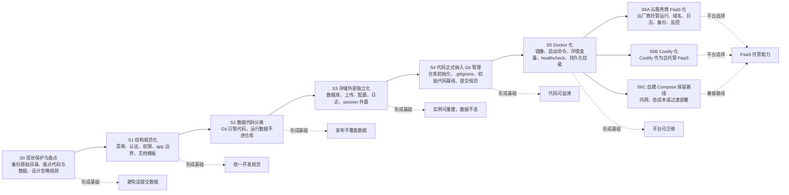
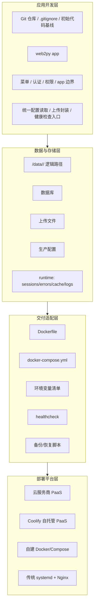
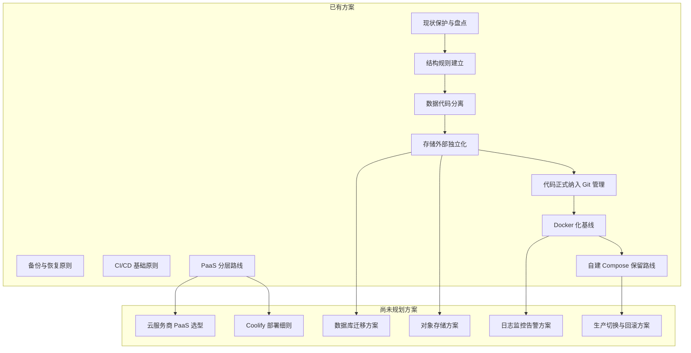
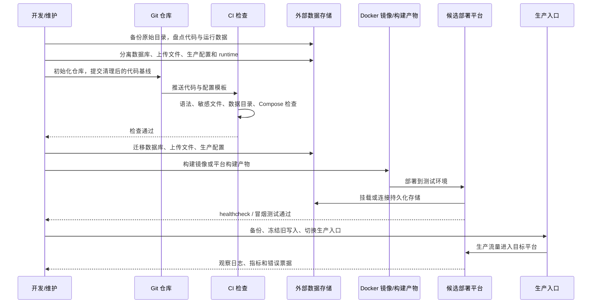

# 数据存储与 PaaS 部署治理路线图

> 版本: v1.1  
> 日期: 2026-06-23  
> 适用范围: web2py 服务的数据存储治理、开发规范收口、部署方案分层、PaaS 平台选型准备；兼容云服务商 PaaS、Coolify、自建 Docker/Compose 和传统 `/opt/<web2py_service>` 部署

本文是方案覆盖图谱，不是项目实施进度表。当前只区分已有方案部分和尚未规划部分；不记录完成百分比和路线占比。涉及时间节点时，只表达治理顺序、前置条件和建议截止点，不代表当前执行进度。

核心判断:

- web 开发规范必须保持平台中立，不能绑定 Coolify、某一家云厂商或某一种服务器路径。
- Docker 化是走向 PaaS 的通用交付基础，但 Docker 化不等同于 Coolify 化。
- PaaS 可以选择云服务商，也可以选择 Coolify 这类自托管平台；二者是分开的平台路线。
- 正式 Git 纳管应放在结构规范化、数据代码分离、存储外部独立化之后；在此之前只做保护性备份、现状盘点和忽略规则设计，避免把数据库、上传文件、真实配置和 runtime 纳入仓库。
- 结构规则建立、数据代码分离、存储外部独立化、代码正式纳入 Git、Docker 化、PaaS 化是递进关系。

## 1. 方案总览

### 1.0 S0-S7 对应文档

| 阶段 | 对应文档 | 说明 |
| --- | --- | --- |
| S0 | `S0-现状保护与盘点规范.md` | 原始备份、现状盘点、`.gitignore` 草案 |
| S1 | `S1-结构规范化规范.md` | 菜单、认证、权限、app 边界、文档结构 |
| S2 | `S2-数据代码分离规范.md` | 代码与运行数据边界 |
| S3 | `S3-存储外部独立化规范.md` | 数据库、uploads、config、runtime 外置 |
| S4 | `S4-代码正式纳入Git管理规范.md` | 正式建仓、初始代码基线、分支与提交规则 |
| S5 | `S5-Docker化规范.md` | Dockerfile、Compose、env、volume、healthcheck |
| S6 | `S6-平台部署路线规范.md` | 云 PaaS、Coolify、自建 Compose 分路线 |
| S7 | `S7-生产切换与回滚规范.md` | 切换、验证、回滚 |

### 1.1 主阶梯与分叉路线

### 1.2 分层结构图

### 1.3 方案覆盖关系图

### 1.4 目标交付时序图

### 1.5 方案覆盖看板

| 阶段 | 归类 | 已有口径 | 后续需成文 / 尚未规划问题 |
| --- | --- | --- | --- |
| S0 现状保护与盘点 | 已有方案 | 先备份原始目录，盘点代码、数据库、上传文件、真实配置和 runtime，不做正式初始提交 | 原始备份清单、数据路径清单、`.gitignore` 草案、敏感文件清单 |
| S1 结构规范化 | 已有方案 | 菜单、认证、权限、app 边界、项目文档模板已有通用规则 | 项目级差异清单可继续补充 |
| S2 数据代码分离 | 已有方案 | 明确代码、数据库、上传文件、真实配置、runtime 的边界 | 需要逐项目补运行数据清单 |
| S3 存储外部独立化 | 已有方案 | 外置原则明确，目标路径为 `/data/<web2py_service>/<app>` | 数据库、uploads、config、runtime 的迁移模板和验证清单 |
| S4 代码正式纳入 Git 管理 | 已有方案 | S1-S3 清理完成后，提交清理后的代码基线，运行数据、真实配置和敏感文件不得进入 Git | 仓库初始化、`.gitignore`、初始提交、分支策略、提交规范和准入检查清单 |
| S5 Docker 化 | 已有方案 | 已确定为 PaaS 前置能力，不绑定 Coolify | Dockerfile、Compose、env、volume、healthcheck 标准样例 |
| S6A 云服务商 PaaS 化 | 尚未规划 | 已明确与 Coolify 分路线 | 云厂商选型、成本、日志、备份、回滚和验收方案 |
| S6B Coolify 化 | 尚未规划 | 已定位为自托管 PaaS 可选路线 | Coolify 项目模板、volume、域名证书、备份恢复和回滚步骤 |
| S6C 自建 Docker/Compose | 已有方案 | 已定位为过渡、内网或低成本路线 | Compose 样例、网络、服务依赖、运维脚本 |
| S7 生产切换 | 尚未规划 | 已明确必须保留回滚路径 | 切换窗口、备份冻结、DNS/入口切换、回滚演练方案 |

> 本版暂不使用甘特图。甘特图适合进入执行计划阶段后再补充。

### 1.6 建议时间节点

| 时间节点 | 治理主题 | 截止要求 | 未完成影响 |
| --- | --- | --- | --- |
| T0 / 第 0 周 | S0 现状保护与盘点 | 备份原始目录，盘点代码、数据库、上传文件、真实配置和 runtime，形成 `.gitignore` 草案 | 直接建仓可能误提交生产数据、密钥和 runtime |
| T1 / 第 1 周 | S1 结构规范化 | 完成菜单、认证、权限、app 边界和项目文档模板的统一口径 | 后续治理范围不清，项目差异难以记录 |
| T2 / 第 2-3 周 | S2 数据代码分离 | 明确哪些文件未来可进 Git，哪些运行数据必须外置或忽略 | 容器化和 PaaS 化时容易覆盖生产数据 |
| T3 / 第 4-5 周 | S3 存储外部独立化 | 形成数据库、uploads、config、runtime 的迁移模板和验证清单 | 服务实例无法做到可重建，迁移风险高 |
| T4 / 第 6 周 | S4 代码正式纳入 Git 管理 | 在 S1-S3 清理后完成仓库初始化、初始代码基线提交和基础 CI 检查 | 后续 Docker 化、平台化缺少可追溯代码基线 |
| T5 / 第 7 周 | S5 Docker 化 | 形成 Dockerfile、Compose、env、volume、healthcheck 基线样例 | PaaS 选型缺少统一交付入口 |
| T6 / 第 8 周以后 | S6 平台路线规划 | 分别规划云服务商 PaaS、Coolify 和自建 Compose 的部署细则 | 平台专用配置容易污染 web 开发规范 |

## 2. 已有方案部分

| 方案主题 | 已有口径 | 当前关联文档 | 后续需成文 |
| --- | --- | --- | --- |
| 现状保护与盘点 | 正式建仓前先备份原始目录，盘点代码、运行数据、真实配置和 runtime | 本文档、`web2py服务备份规范.md`、`数据代码分离统一规范.md` | 原始备份清单、数据路径清单、`.gitignore` 草案 |
| 结构规则建立 | 菜单、认证、权限、app 边界、项目文档模板已有规范基础 | `web2py服务开发规范.md`、`菜单架构统一规范.md`、`80-模板/项目文档模板.md` | 项目级差异清单 |
| 数据代码分离 | 明确代码、运行数据、真实配置、上传文件不进入 Git | `数据代码分离统一规范.md` | 各项目真实数据路径清单 |
| 备份与恢复原则 | 明确备份对象、恢复校验和发布前保护边界 | `web2py服务备份规范.md` | 备份恢复演练脚本 |
| CI/CD 基础原则 | 已有发布门禁、敏感文件检查和部署流程口径 | `持续集成与持续部署标准流程方案.md` | Docker 与 PaaS 部署检查项 |
| PaaS 分层路线 | 已把 Docker 化、云服务商 PaaS、Coolify、自建 Compose 拆成不同层级 | 本文档 | 平台专用配置独立文档 |
| 存储外部独立化 | 数据库、上传、配置、runtime 应离开 app 目录 | 本文档、`数据代码分离统一规范.md` | 迁移步骤、目录权限、回滚方式、验证清单 |
| 代码正式纳入 Git 管理 | S1-S3 清理完成后再进入 Git，形成可追溯代码基线；运行数据、真实配置和敏感文件不得进入仓库 | 本文档、`持续集成与持续部署标准流程方案.md`、`数据代码分离统一规范.md` | Git 初始化清单、`.gitignore` 模板、分支策略、提交规范、敏感文件检查 |
| Docker 化基线 | Docker 是 PaaS 前置能力和跨平台交付基础 | 本文档 | Dockerfile、Compose、环境变量、volume、healthcheck |
| 自建 Compose 保留路线 | 可作为过渡、内网部署和平台选型前验证入口 | 本文档 | 网络、服务依赖、日志、备份、升级回滚 |

## 3. 尚未规划部分

| 方案主题 | 为什么需要单独规划 | 规划时必须回答的问题 |
| --- | --- | --- |
| 云服务商 PaaS 选型 | PaaS 可以外包给云服务商，不应默认自建 | 候选平台、费用、构建方式、持久化存储、日志、备份、网络限制 |
| Coolify 部署细则 | Coolify 是一条独立自托管 PaaS 路线 | 项目模板、Compose 兼容性、volume、域名证书、备份恢复、升级策略 |
| 数据库迁移方案 | SQLite 适合轻量项目，高并发或多实例需要外部数据库 | 何时迁移 PostgreSQL/MySQL、如何迁移、如何校验、如何回滚 |
| 对象存储方案 | 上传文件未来可能不适合继续放本地 volume | OSS/S3 兼容方案、URL 策略、权限、迁移脚本、备份边界 |
| 日志监控告警方案 | PaaS 化后排障依赖平台日志和指标 | stdout/stderr、应用错误票据、访问日志、告警阈值、责任人 |
| 生产切换与回滚方案 | 部署平台改变会影响入口、数据一致性和故障恢复 | 切换窗口、冻结写入、备份点、DNS/入口切换、回滚触发条件 |

## 4. 技术栈治理矩阵

| 技术栈 / 治理域 | S0 现状保护 | S1 结构规范化 | S2 数据代码分离 | S3 存储外部独立化 | S4 Git 管理 | S5 Docker 化 | S6A 云服务商 PaaS | S6B Coolify |
| --- | --- | --- | --- | --- | --- | --- | --- | --- |
| 项目与 app 清单 | 列出项目、app、代码目录和负责人 | 项目、app、负责人、活跃状态登记 | 标记数据归属和发布范围 | 标记外部数据目录 | 初始提交只包含确认范围 | 构建产物只包含确认范围 | 作为云 PaaS 试点选择依据 | 作为 Coolify 项目创建依据 |
| 代码仓库 | 只设计 `.gitignore`，不做正式初始提交 | 目录结构和模板准备 | 确认只提交代码和配置样例 | 外部路径约定准备入库 | 初始化 Git、设置 `.gitignore`、形成清理后的初始提交 | Dockerfile、Compose、env example 入库 | 平台配置示例独立维护 | Coolify 配置示例独立维护 |
| 数据库 | 盘点数据库文件 | 统一 DAL 配置规范 | 数据库文件不进入 Git | 外置到 `/data/.../databases` 或独立数据库 | 确认数据库文件不在仓库 | 通过 volume 或外部连接持久化 | 评估托管数据库或平台插件 | 评估挂载 volume 或外部数据库 |
| 上传文件 | 盘点 uploads | 统一上传入口和权限 | uploads 不进入 Git | 外置到 `/data/.../uploads` | 确认 uploads 不在仓库 | volume 挂载或对象存储适配 | 评估云对象存储 | 评估 volume 或 S3 兼容存储 |
| 配置与密钥 | 盘点真实配置和密钥 | 统一配置读取方式 | 只提交 `.example` | 真实配置放 `/data/.../config` 或密钥系统 | 确认真实配置不在仓库 | 支持 env 和配置文件注入 | 使用云平台变量和密钥能力 | 使用 Coolify 环境变量和密钥 |
| sessions/errors/cache/logs | 盘点 runtime | 明确 runtime 写入边界 | runtime 不进入 Git | 外置或改为平台日志 | runtime 全部加入忽略规则 | 输出到 stdout/stderr 或 volume | 接入云日志和监控 | 接入 Coolify 日志和外部监控 |
| web2py 代码规范 | 备份改造前原始代码 | 禁止把平台路径写死到业务逻辑 | 禁止依赖 app 目录数据 | 统一路径解析和封装 | 初始提交作为改造后代码基线 | 使用环境变量和逻辑路径 | 保持平台中立 | Coolify 专用配置不进业务代码 |
| 认证与权限 | 记录当前认证权限代码状态 | 统一认证与权限入口 | 避免用户态数据写入代码目录 | 评估 session 外置需求 | 记录清理后的权限代码状态 | 明确容器内 session 策略 | 多实例前确认 session/cache 方案 | 多实例前确认 session/cache 方案 |
| CI 检查 | 准备敏感文件检查规则 | 检查结构和模板 | 检查敏感文件和运行数据 | 检查外部数据路径约定 | 建仓后先加基础敏感文件检查 | 检查 Dockerfile、Compose、healthcheck | 检查平台变量和部署配置 | 检查 Coolify/Compose 配置边界 |
| 备份与恢复 | 正式纳管前先备份原始目录 | 明确备份对象 | 排除代码仓库中的运行数据 | 备份 `/data` 和外部数据库 | Git 初始提交前再次确认备份 | 验证容器重建后数据可恢复 | 演练云平台恢复 | 演练 Coolify 恢复 |

## 5. 重点难点

| 主题 | 重点 | 难点 |
| --- | --- | --- |
| 正式 Git 纳管 | S1-S3 完成后再形成可追溯代码基线 | 旧目录里可能混有数据库、上传文件、真实配置、日志和临时文件，初始提交前必须排除 |
| web 开发规范平台中立 | 应用代码只依赖逻辑路径、环境变量和配置模板 | 历史代码可能硬编码 `/opt`、`request.folder/uploads` 或 app 内 runtime 路径 |
| 数据代码分离 | Git 只管理代码、模板和文档 | 旧项目可能把数据库、上传文件、真实配置混在 app 目录 |
| 存储外部独立化 | 数据库、uploads、config、runtime 有稳定外部位置 | 迁移时要保证旧链接、下载接口、权限和备份恢复都不破坏 |
| Docker 化 | 镜像可重建，运行数据通过 volume 或外部服务保留 | Python/web2py 版本、系统依赖、文件权限、启动命令可能不统一 |
| 云服务商 PaaS | 让云平台承担日志、备份、监控、域名等运维能力 | 不同云厂商的构建方式、持久化能力和成本差异较大 |
| Coolify 化 | 用自托管 PaaS 获得部署体验，同时保留服务器控制权 | Coolify 专用配置容易和通用开发规范混在一起 |
| 生产切换 | 切换前有备份、冻结、验证、回滚路径 | 数据一致性、切换窗口和故障回退需要单独演练 |

## 6. 方案完整性检查方法

| 检查对象 | 判断问题 | 证据材料 |
| --- | --- | --- |
| 已有方案 | 是否已经有稳定文档、明确边界和当前推荐口径 | 根目录通用规范、项目文档索引、历史方案替代说明 |
| 尚未规划方案 | 是否还没有选型标准、操作细则或风险边界 | 规划问题清单、候选路线列表、决策记录 |
| 平台路线 | 是否把 Docker 化、云 PaaS、Coolify 分开维护 | 部署层文档、平台专用配置、环境变量清单 |
| 项目落地 | 是否只记录项目事实，不复制通用规范正文 | `projects/<web2py_service>/规范对照.md`、`运行数据与配置.md` |

## 7. 项目级方案状态模板

每个项目在 `projects/<web2py_service>/规范对照.md` 中只记录项目事实、差异和缺口，不维护完成百分比。

| 项目 | 现状保护 | 结构规则 | 数据代码分离 | 存储外部独立化 | Git 管理 | Docker 化 | 目标平台候选 | 已有证据 | 尚未规划问题 |
| --- | --- | --- | --- | --- | --- | --- | --- | --- | --- |
| `<web2py_service>` | 已备份/待备份 | 已有/尚未规划 | 已有/尚未规划 | 已有/尚未规划 | 未纳管/已纳管 | 已有/尚未规划 | 未定/云 PaaS/Coolify/Compose | `<evidence>` | `<missing_plan>` |

## 8. 治理红线

- 运行数据、真实配置、数据库、上传文件不得进入 Git。
- S1-S3 未完成前，不应做正式 Git 初始提交；正式 Git 纳管后，再推进 Docker 化和平台化。
- 部署脚本不得覆盖 `/data/<web2py_service>`。
- 新 app 和主动改造 app 不得依赖 app 目录内的 `databases/`、`uploads/`、`sessions/`、`errors/`、`cache/`。
- Docker 化是通用交付能力，Coolify 化是自托管 PaaS 路线，二者必须分开表述。
- 云服务商 PaaS、Coolify、自建 Docker/Compose 和传统 systemd 都是部署平台选项，不是应用代码依赖。
- 平台专用配置必须和 web 开发规范隔离。
