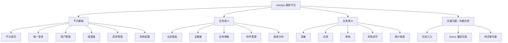

# 系统导航与页面总览

> 适用根目录: `/opt/<web2py_service>/applications`  
> 用途: 统一登记顶部固定导航、Mega menu / 网站地图、侧面导航、面包屑、页内导航、页面路由、权限和截图索引，避免只靠逐页浏览理解系统。

## 0. 使用说明

本文用于登记菜单和页面事实。菜单类型、变量职责、层级上限、展示模式、禁止事项和存量治理步骤以 `../菜单架构统一规范.md` 为准。

导航分层:

| 层级 | 变量/位置 | 归属 | 用途 |
| --- | --- | --- | --- |
| 顶部固定导航 | `response.system_nav` / `response.menu` | `service_center` 统一维护 | 系统级全局入口 |
| Mega menu / 网站地图 | `response.global_menu` / `response.app_launcher` | `service_center` 统一维护 | 全局二层入口总览 |
| 侧面导航 | `response.side_nav` / `response.sub_menu` | 当前 app 或统一菜单服务 | 当前 app 同级和次级页面 |
| 面包屑导航 | `response.breadcrumb` | 当前路由、菜单树或页面 | 当前页面垂直路径 |
| 页内导航 | `response.page_nav` / `response.page_menu` | 当前页面或当前功能模块 | 当前页面内部内容和视图 |
| Toolbar | `response.toolbar` | 当前页面 | 当前页面动作或强相关快捷跳转 |

最小验收:

- 顶部固定导航不混入普通业务菜单。
- Mega menu / 网站地图使用二层结构: 分类头 + 入口项。
- 进入 `<app>` 后，侧面导航能进行同级和次级页面跳转。
- 面包屑能显示当前位置。
- 当前页面内部视图使用页内导航。
- Toolbar 如存在，只放当前页面动作或强相关快捷跳转。

## 1. 平台能力地图模板

## 2. 顶部固定导航清单模板

本节只登记系统级全局入口，不登记普通业务菜单。

| 菜单 | URL | 权限 | 状态 | 说明 |
| --- | --- | --- | --- | --- |
| 平台首页 | `/<platform_app>/default/index` | 登录/平台访问 | 保留 | 平台入口 |
| 应用/网站地图 | `#` | 登录 | 保留 | 打开 Mega menu 或网站地图 |
| 站内通知 | `/<platform_app>/notice/index` | 登录 | 可选 | 全局通知 |
| 站内信 | `/<platform_app>/message/index` | 登录 | 可选 | 站内消息 |
| 分公司/组织切换 | `#` | 登录 | 可选 | 全局组织上下文 |
| 系统管理 | `/<platform_app>/mgr/index` | `admin`、`manager` | 保留 | 用户、组、菜单、系统配置 |
| 用户菜单 | `/<platform_app>/default/user` | 登录/公开混合 | 保留 | 登录、退出、个人资料 |

## 3. Mega menu / 网站地图模板

Mega menu / 网站地图使用二层结构。第一层为分类头，不跳转；第二层为入口项。

| 分类头 | 入口 | URL | 权限 | 状态 | 说明 |
| --- | --- | --- | --- | --- | --- |
| 业务域 A | 看板 | `/<business_app_a>/default/dashboard` | 登录/业务权限 | 保留 | 模块入口 |
| 业务域 A | 主数据 | `/<business_app_a>/master_data/index` | 登录/业务权限 | 保留 | 模块入口 |
| 业务域 A | 报表 | `/<business_app_a>/reports/index` | 登录/业务权限 | 保留 | 模块入口 |
| 系统工具 | 用户管理 | `/<platform_app>/mgr/auth_user` | `admin`、`manager` | 保留 | 平台工具 |
| 存量功能 | 历史入口 | `/<platform_app>/default/frame?...` | 登录/存量权限 | 待治理 | iframe 或历史入口 |

## 4. 侧面导航模板

侧面导航用于当前 app 同级和次级页面，最多两层。

### 4.1 `<business_app_a>` 侧面导航

| 一级菜单 | 二级菜单 | URL | 权限 | 状态 |
| --- | --- | --- | --- | --- |
| 看板 | - | `/<business_app_a>/default/dashboard` | 登录/业务权限 | 保留 |
| 主数据 | 主数据列表 | `/<business_app_a>/master_data/index` | 登录/业务权限 | 保留 |
| 业务单据 | 记录列表 | `/<business_app_a>/records/index` | 登录/业务权限 | 保留 |
| 报表 | 统计报表 | `/<business_app_a>/reports/index` | 登录/业务权限 | 保留 |

## 5. 面包屑模板

| 页面 | 面包屑 | 说明 |
| --- | --- | --- |
| 详情页 | `业务域 > 模块 > 页面 > 详情` | 详情页可以出现在面包屑中，但不一定出现在菜单中 |
| 编辑页 | `业务域 > 模块 > 页面 > 编辑` | 表单页通常由 toolbar 或列表行入口进入 |

## 6. 页内导航模板

页内导航用于当前页面内部内容、状态或视图切换，最多两层。

| 页面 | 一级页内导航 | 二级页内导航 | 说明 |
| --- | --- | --- | --- |
| 记录列表 | 列表 / 看板 / 统计 | 全部 / 待处理 / 已完成 / 已归档 | 常规页面优先只用一层 |
| 详情页 | 基本信息 / 附件 / 审批记录 / 操作日志 | - | 详情页内容分区 |

## 7. Toolbar 模板

Toolbar 是页面动作区或页面快捷区，完全可选。

| 页面 | 动作/快捷入口 | URL/行为 | 权限 | 说明 |
| --- | --- | --- | --- | --- |
| 列表页 | 新增 | `create` | `<app>_create` | 页面动作 |
| 列表页 | 导入 | `import` | `<app>_import` | 页面动作 |
| 列表页 | 导出 | `export` | `<app>_export` | 页面动作 |
| 列表页 | 查看统计 | `stats` | `<app>_view` | 强相关快捷跳转 |

## 8. 页面路由清单模板

### 5.1 `<platform_app>`

| 页面名称 | URL | 控制器/方法 | 页面用途 | 权限 | 状态 |
| --- | --- | --- | --- | --- | --- |
| 平台首页 | `/<platform_app>/default/index` | `default.index` | 平台入口与工作台 | 登录/平台访问 | 保留 |
| 用户中心 | `/<platform_app>/default/user` | `default.user` | web2py auth 用户动作 | 公开/登录混合 | 保留 |
| 管理首页 | `/<platform_app>/mgr/index` | `mgr.index` | 系统管理入口 | `admin`/`manager` | 保留 |
| 用户管理 | `/<platform_app>/mgr/auth_user` | `mgr.auth_user` | 用户列表、筛选、操作 | `admin`/`manager` | 保留 |
| 组管理 | `/<platform_app>/mgr/auth_group` | `mgr.auth_group` | 角色组列表 | `admin`/`manager` | 保留 |
| 菜单管理 | `/<platform_app>/mgr/menu_items` | `mgr.menu_items` | 菜单表管理 | `admin`/`manager` | 保留 |

### 5.2 `<business_app_a>`

| 页面名称 | URL | 控制器/方法 | 页面用途 | 数据来源 | 状态 |
| --- | --- | --- | --- | --- | --- |
| 看板 | `/<business_app_a>/default/dashboard` | `default.dashboard` | 业务概览 | 业务统计表 | 保留 |
| 主数据列表 | `/<business_app_a>/master_data/index` | `master_data.index` | 主数据查询 | 主数据表 | 保留 |
| 主数据编辑 | `/<business_app_a>/master_data/edit/<id>` | `master_data.edit` | 新增/编辑 | 主数据表 | 页面动作 |
| 记录列表 | `/<business_app_a>/records/index` | `records.index` | 业务记录查询 | 业务记录表 | 保留 |
| 报表 | `/<business_app_a>/reports/index` | `reports.index` | 统计与导出 | 聚合查询 | 保留 |

## 9. 权限矩阵模板

| 权限码 | 角色/用户组 | 适用 app | 适用页面 | 操作 | 说明 |
| --- | --- | --- | --- | --- | --- |
| `<app>_admin` | app 管理员 | `<app>` | 全部 | 管理 | app 管理权限 |
| `<app>_view` | 普通用户 | `<app>` | 列表/详情 | 查看 | 只读访问 |
| `<app>_edit` | 业务维护人员 | `<app>` | 表单页面 | 新增/编辑 | 数据维护 |
| `<app>_review` | 审核人员 | `<app>` | 审核页面 | 审核 | 流程审核 |

## 10. 页面截图索引模板

| 页面 | URL | 设计稿 | 实现截图 | 视口 | 状态 | 备注 |
| --- | --- | --- | --- | --- | --- | --- |
| 平台首页 | `/<platform_app>/default/index` | `design/<page>.png` | `screenshots/<page>-desktop.png` | desktop | 待验收 | - |
| 业务看板 | `/<business_app_a>/default/dashboard` | `design/<page>.png` | `screenshots/<page>-desktop.png` | desktop | 待验收 | - |
| 移动端页面 | `/<business_app_a>/default/dashboard` | `design/<page>-mobile.png` | `screenshots/<page>-mobile.png` | mobile | 待验收 | - |

## 11. 历史菜单残留清理清单

| 菜单/页面 | 当前位置 | 问题 | 处理方式 | 状态 |
| --- | --- | --- | --- | --- |
| `<legacy_menu>` | `<legacy_app>` | 重复入口或旧 UI | 合并/迁移/删除 | 待确认 |
| `<legacy_page>` | `<legacy_app>` | 无权限控制或路径混乱 | 接入统一认证 | 待确认 |

## 12. 待确认问题

- 顶部固定导航保留哪些系统级入口。
- Mega menu / 网站地图采用哪些分类头。
- 每个 app 的侧面导航如何控制在两层以内。
- 哪些页面需要页内二层导航，哪些应改用筛选器或选项卡。
- 哪些页面动作或快捷跳转需要进入 toolbar。
- 哪些存量入口继续 iframe 兼容，哪些应改为原生页面。
- 哪些页面需要补充权限码、设计稿和截图。
