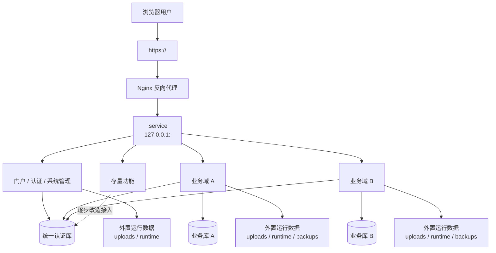
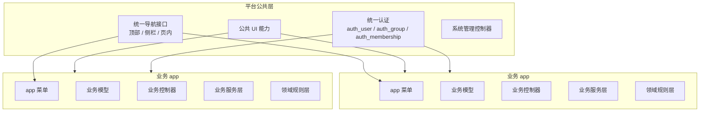
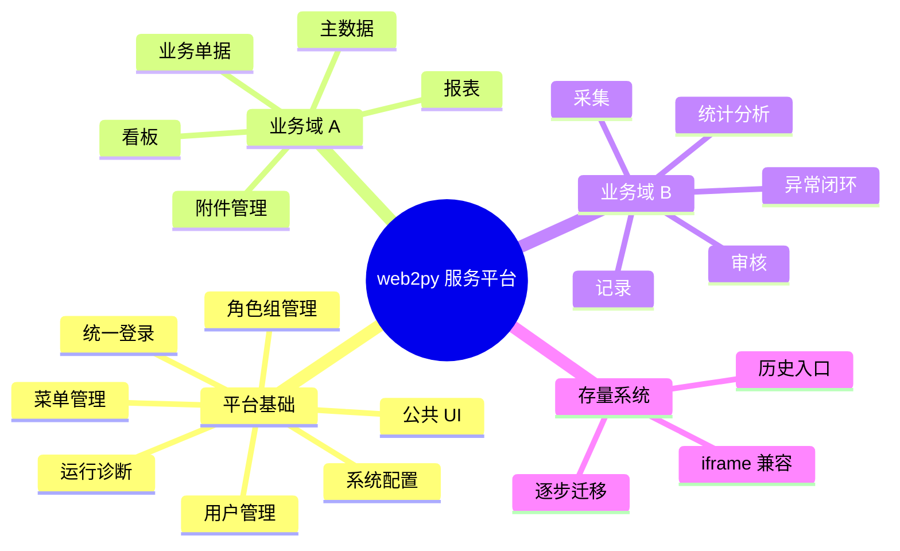
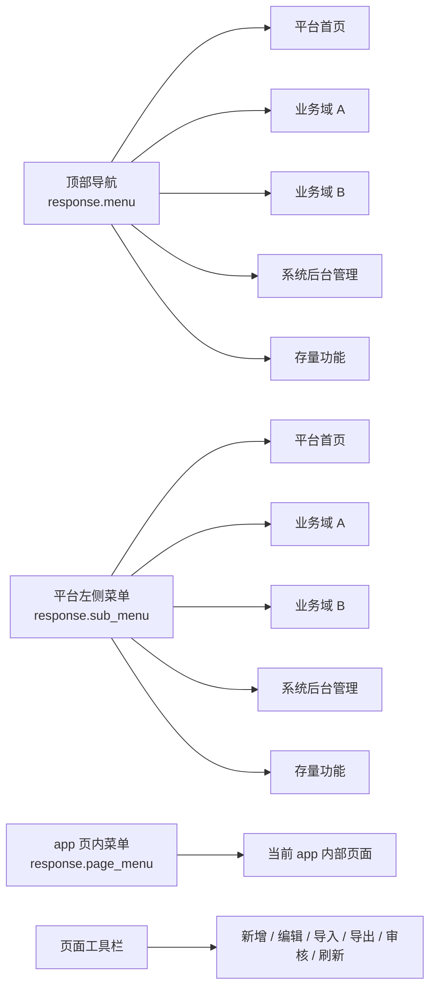
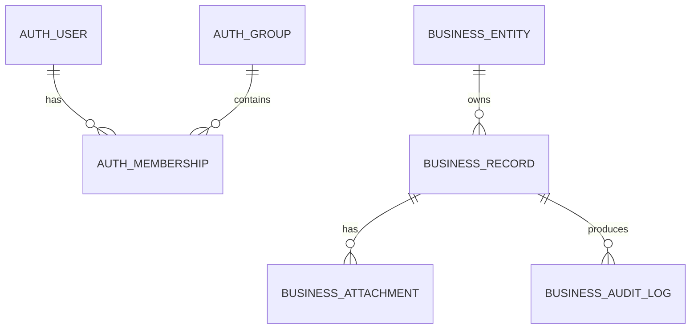

# web2py 服务系统架构与功能图

> 适用根目录: `/opt/<web2py_service>`  
> 运行入口: `https://<domain>`  
> 用途: 为多 app web2py 服务提供统一架构表达模板。

## 1. 系统定位

web2py 服务平台通常由一个平台 app 和多个业务 app 组成。平台 app 提供统一入口、认证、用户、角色、菜单和公共 UI；业务 app 按业务域拆分，独立维护业务数据、页面和权限。

| 层级 | 示例归属 | 职责 |
| --- | --- | --- |
| 平台层 | `<platform_app>` | 统一入口、统一认证、用户/角色/菜单管理、顶部导航、公共 UI 能力 |
| 业务层 | `<business_app>` | 某一业务域的模型、控制器、页面、报表和附件 |
| 集成层 | `<integration_app>` | 外部系统接口、定时同步、数据交换 |
| 存量层 | `<legacy_app>` | 历史功能，逐步接入统一认证、导航和数据规范 |

核心原则:

- 统一登录、用户、角色和平台菜单只维护一套。
- 业务 app 可以按业务域拆分，但不能各自复制认证和平台导航。
- 顶部导航、平台左侧菜单、app 页内菜单、页面工具栏分工明确。
- app 代码目录与运行数据目录分离。

## 2. 运行架构图

## 3. 代码分层图

## 4. 平台能力图

## 5. 导航架构图

导航边界:

| 区域 | 归属 | 说明 |
| --- | --- | --- |
| 顶部导航 | 平台级入口 | 面向系统级或业务域级入口 |
| 平台左侧菜单 | 平台和业务域入口 | 最多两级，不放页面动作 |
| app 页内菜单 | 当前 app 内部页面入口或功能组切换 | 由业务 app 自己维护 |
| 页面工具栏 | 当前页面动作 | 新增、编辑、导入、导出、审批等动作 |

导航变量契约:

| 变量 | 架构归属 | 职责 |
| --- | --- | --- |
| `response.menu` | 顶部导航 | 平台级入口，由平台 app 统一生成，各 app 统一渲染 |
| `response.sub_menu` | 平台左侧菜单 | 平台和业务域入口，由平台 app 统一生成，各 app 不得挪作内部菜单 |
| `response.page_menu` | app 页内菜单 | 当前 app 内部页面入口，由业务 app 自己维护 |

这些变量是跨 app 的系统级契约。开发规范和项目实现只能遵守这个契约，不应重新定义变量含义。

## 6. 数据关系图模板

建议:

- 认证表由平台 app 统一维护。
- 业务表归属于业务 app 的独立数据库或清晰命名空间。
- 附件实体应放在 app 外部运行数据目录，数据库只保存文件名、业务归属和元数据；具体路径以数据代码分离规范为准。

## 7. 应用矩阵模板

| App | 类型 | 认证方式 | 导航方式 | 业务库 | 运行数据目录 | 状态 |
| --- | --- | --- | --- | --- | --- | --- |
| `<platform_app>` | 平台 app | 自身维护 | 顶部/侧栏来源 | 认证库 | 外置运行数据目录 | 当前 |
| `<business_app_a>` | 业务 app | 共享认证 | 平台导航 + app 页内菜单 | 独立业务库 | 外置运行数据目录 | 当前 |
| `<business_app_b>` | 业务 app | 共享认证 | 平台导航 + app 页内菜单 | 独立业务库 | 外置运行数据目录 | 当前 |
| `<legacy_app>` | 存量 app | 待统一 | 存量入口 | 待梳理 | 待梳理 | 待改造 |

## 8. 待确认清单

- 哪个 app 是平台 app。
- 哪些业务域需要拆成独立 app。
- 哪些存量 app 保留 iframe 兼容入口。
- 哪些 app 需要独立业务库。
- 哪些运行数据目录还在 app 代码目录内，需要迁移到外置运行数据目录。
